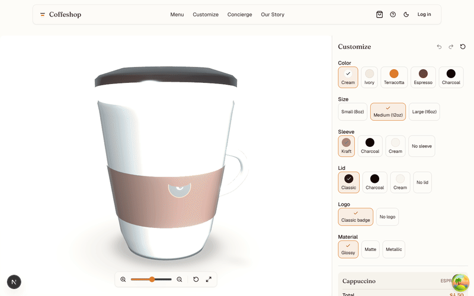
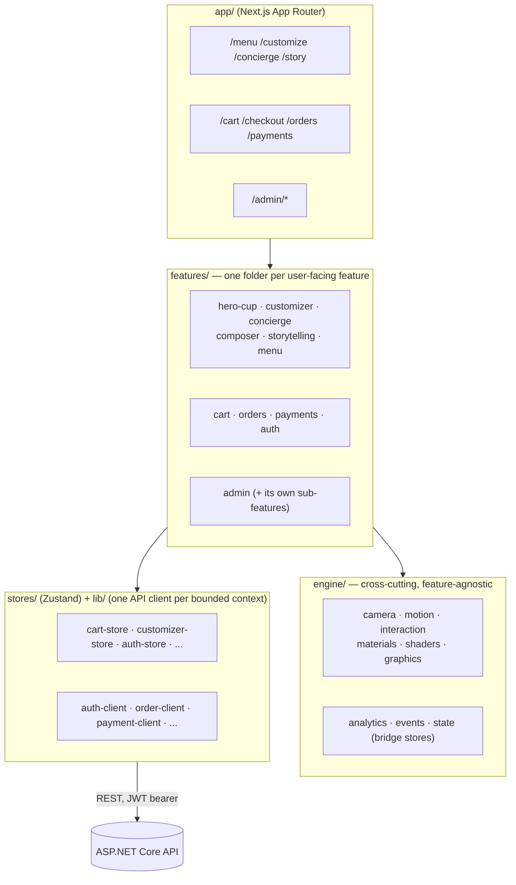
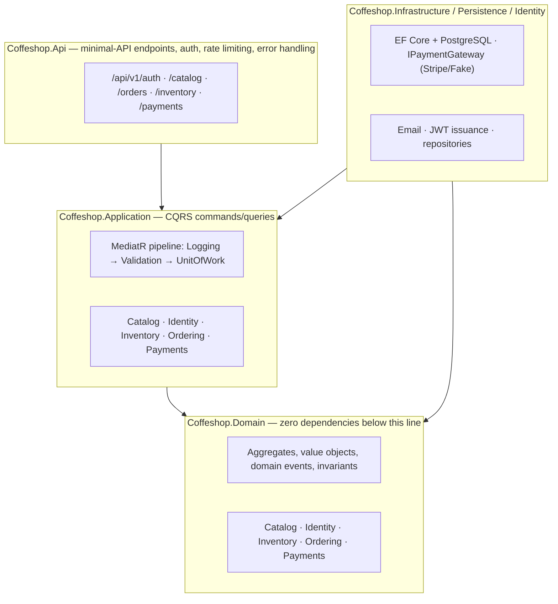

# Coffeshop



[](https://github.com/Ali-Khamis45/my-super-duper-project/actions/workflows/ci.yml)

**Live demo:** not yet deployed — see [`docs/DEPLOYMENT.md`](docs/DEPLOYMENT.md) for the concrete path (frontend and backend are both deploy-ready: Dockerfile built and verified, health checks, an opt-in seed command) and exactly what's blocking it.

## What this is

A full-stack coffee shop with a live, draggable 3D cup you actually customize — color, size, sleeve, lid, material, all rendered in real time with React Three Fiber, not pre-rendered images — sitting on top of a real commerce backend: accounts with JWT + rotating refresh tokens, a Postgres-backed product catalog, a full order lifecycle, inventory reservation tied into checkout so nothing oversells, and payments that actually charge a real (test-mode) gateway. It was built as a running engineering exercise in doing this the way a real team would: a frozen architecture before code, CQRS and DDD on the backend, an adversarial review at the end of every sprint that finds and fixes real bugs rather than declaring victory, and every one of those findings written down honestly — including the ones still open. `docs/reviews/` holds 20+ of these, one per sprint, going back to the project's first commit.

## Architecture

**Frontend** — feature folders, a cross-cutting `engine/` layer underneath them (camera, motion, materials, interaction — the same systems every 3D-touching feature composes instead of reimplementing), a thin `lib/` per backend bounded context:



**Backend** — Clean Architecture, dependencies point one way only (`Api` → `Infrastructure`/`Persistence` → `Application` → `Domain`), CQRS via MediatR, one identical set of bounded-context subfolders repeated across every layer:



The same five bounded-context names — Catalog, Identity, Inventory, Ordering, Payments — recur identically across `Domain`, `Application`, and `Persistence`. That consistency isn't incidental; it's checked (see `docs/reviews/file-organization-audit.md`).

## Tech stack

**Frontend:** Next.js 16 (App Router, RSC) · React 19 · TypeScript (strict) · Tailwind CSS v4 · shadcn/ui (Base UI) · Zustand · TanStack Query · Framer Motion · GSAP · Lenis · Three.js · React Three Fiber · drei · postprocessing.

**Backend:** ASP.NET Core 10 · Clean Architecture · CQRS/MediatR · Entity Framework Core · PostgreSQL · Redis · Stripe.

**Testing:** Vitest (frontend unit) · xUnit (.NET, real Testcontainers Postgres for integration tests — never mocked at that layer) · Playwright (e2e, 3 browsers) · GitHub Actions CI on every push/PR.

## What this demonstrates

- **DDD + CQRS, for real, not as a buzzword.** Five bounded contexts (Catalog, Identity, Inventory, Ordering, Payments), each with its own aggregates, value objects, and domain events, mapped identically across every architectural layer. Repositories, MediatR commands/queries, and a pipeline of cross-cutting behaviors (logging → validation → unit-of-work) applied uniformly.
- **A real, reasoned trade-off between transactional consistency and eventual consistency — and knowing which one a given question needs.** The outbox pattern handles eventually-consistent cross-context notification (Analytics, Audit, future Notifications) correctly. But "does this order actually have the stock it needs" and "is this order actually paid" can't wait for an eventually-consistent dispatcher to catch up — so `IInventoryReservationCoordinator` and `IOrderPaymentCoordinator` deliberately call directly, same-transaction, across the Ordering↔Inventory and Ordering↔Payments boundaries instead. This is a real, disclosed deviation from the project's own frozen DDD model ("no handler touches two aggregate roots from two different bounded contexts in one transaction") — made consciously, reasoned in the sprint reviews each time it happened, not an oversight. See [`docs/CASE_STUDY.md`](docs/CASE_STUDY.md).
- **Testing discipline with real, current numbers** (verified by actually running the suites while writing this, not copied from an old doc): **306 backend tests** (176 Domain, 85 Application, 45 Integration — the Integration suite runs against a real Testcontainers PostgreSQL, never a mock), **305 frontend Vitest tests**, and a Playwright e2e suite (351 tests across Chromium/Firefox/WebKit at last full run) with a 26-test Payments/Orders subset re-verified fresh after every relevant change. Every one of these numbers is also what CI checks on every push.
- **Security work that found real bugs, not just checkbox compliance**: rate limiting (`AuthPolicy`, a real 10-req/min/IP ceiling, hit and correctly returning `429` under real test load) sitting alongside a genuine refresh-token reuse-detection bug that was found, fixed, and is still paying off four sprints later — see [`docs/CASE_STUDY.md`](docs/CASE_STUDY.md)'s first two war stories. Passwords via ASP.NET Identity's own PBKDF2 hasher, never custom; every token stored as its hash, never the raw value; CORS locked to a named origin for credentialed requests, never `*`.
- **Honest engineering process.** 20+ sprint review docs, a risk register, and this repo's own CI — all real, all checked, none decorative.

## Known limitations

Named plainly, not hidden — see [`docs/CASE_STUDY.md`](docs/CASE_STUDY.md#whats-deliberately-unfinished-and-why) for the full, current list with reasoning for each: `CancelPaymentCommand` has no gateway-level void/cancel call yet (mitigated, not fixed — the highest-priority real gap in the project today); Redis is provisioned but not yet consumed by any real code; a full GLB/KTX2 3D-asset pipeline exists and has never been used (the cup stays fully procedural); no GDPR/CCPA data export/deletion flow exists yet. For the complete picture of what's shipped, what's open, and what's next across the whole project, see [`explain.md`](explain.md).

## Getting started

The 3D/UI layer (this folder) runs standalone with mocked/static data for most routes. For the full commerce experience (accounts, cart checkout, orders, payments), the [backend](backend/README.md) needs to be running too.

```bash
npm install
npm run dev
```

Then visit:

- `/` — the hero experience
- `/design-system` — the live design-token/component reference
- `/menu`, `/customize`, `/concierge`, `/story` — work without the backend running
- `/login`, `/cart`, `/checkout`, `/orders`, `/payments`, `/admin/*` — need the backend running, see [`backend/README.md`](backend/README.md)

## Scripts

| Command | What it does |
|---|---|
| `npm run dev` | Start the dev server (Turbopack) |
| `npm run build` | Production build |
| `npm run lint` | ESLint |
| `npm run typecheck` | `tsc --noEmit` |
| `npm run format` | Prettier, write mode |

## Learn more

**Start here:** [`docs/00_SYSTEM_PROMPT.md`](docs/00_SYSTEM_PROMPT.md) — the operating philosophy every contributor (human or agent) works to, and the index into the rest of the `docs/` set (architecture, design system, 3D engine, motion engine, coding standards, milestones, the Creative Director Review process). [`docs/01_ARCHITECTURE.md`](docs/01_ARCHITECTURE.md) has the full folder-by-folder rationale for both trees. [`explain.md`](explain.md) is the complete, current project status report. [`docs/CASE_STUDY.md`](docs/CASE_STUDY.md) walks through three real bugs in depth. [`docs/DEPLOYMENT.md`](docs/DEPLOYMENT.md) is the path to a live demo.
