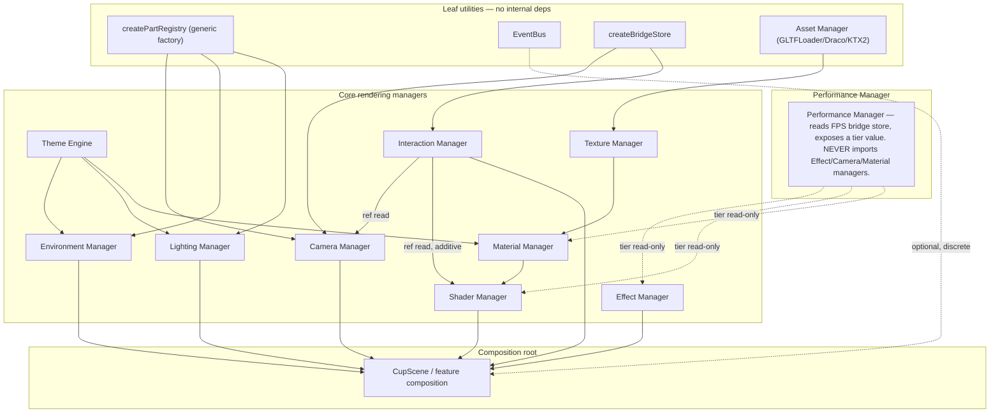

# 15 — Architecture Freeze Report

**Status**: Design freeze in effect. No production code written during this phase — verified via `git status` at the end, same discipline as [milestone-2-architecture-rfc.md](milestone-2-architecture-rfc.md).

This is not a re-approval of the RFC. It's an adversarial pass against it: twelve concrete future features run through the design on paper, a dependency graph checked for cycles, five extensibility claims tested for real, nine failure modes analyzed for detection/recovery, and every manager re-examined for over-/under-engineering. Where that produced a genuine gap, it's fixed here — in design docs only — not glossed over. Six real issues were found; all six are resolved in [Final Review](#final-review) and folded back into [03_3D_ENGINE.md](03_3D_ENGINE.md), [04_MOTION_ENGINE.md](04_MOTION_ENGINE.md), and [3d-asset-pipeline.md](3d-asset-pipeline.md).

## Scenario validation

For each scenario: which managers participate, which interfaces/events are used, what stays isolated, and whether the architecture needs to change. "None" in the last column is the desired answer — it means Milestone 2's design already covers it.

### 1. Steam Shader System

| | |
|---|---|
| Managers | Shader Manager (`SteamMaterial`), Performance Manager (tier read, see #12) |
| Interfaces | `CupPartProps` (steam is already a registered part) |
| Events | None — pure visual, no state to broadcast |
| Isolated | Camera Manager, Interaction Manager, Asset Manager |
| Architectural change | **None.** This is Checkpoint 9 exactly as designed. |

### 2. Coffee Liquid Physics

| | |
|---|---|
| Managers | Shader Manager (vertex displacement on the coffee surface), Interaction Manager (rotation velocity is the input) |
| Interfaces | `CupPartProps`; **requires `useCupInteractionState` to expose angular velocity**, which it currently does not — see gap below |
| Events | None — continuous velocity sampling in `useFrame`, not a discrete event, matches the existing ref-read pattern |
| Isolated | Camera Manager, Asset Manager, Effect Manager |
| Architectural change | **Additive extension**, not a rewrite: `useCupInteractionState`'s return object gains a `velocityRef` field alongside the existing `state`/`rotationYRef`/`bind`. Existing consumers (`CupAssembly`) ignore the new field; nothing breaks. This is the Zero Rewrite Policy working as intended — see [17_ZERO_REWRITE_POLICY.md](17_ZERO_REWRITE_POLICY.md). |

### 3. Ingredient Drag & Drop

| | |
|---|---|
| Managers | Interaction Manager (`useGestureRecognizer`, built exactly for this), a **second** `createPartRegistry` instance for ingredients, Material/Texture Manager (cache), Asset Manager (small GLBs) or Shader Manager (particle burst) |
| Interfaces | `GestureEvent`; a new `IngredientPartProps` contract, same shape convention as `CupPartProps` |
| Events | `ingredient:dropped` on the EventBus — this is the literal example already used when the EventBus was designed in Checkpoint 6; this scenario is the real consumer that validates it |
| Isolated | Camera Manager (unless a drop triggers a parallax nudge, which reuses the existing rig, not a new concept) |
| Architectural change | **None.** Strongest validation in the set — every piece needed already exists on paper. |

### 4. Live Cup Customizer

| | |
|---|---|
| Managers | Material Manager (the cache exists specifically for this), Camera Manager (`product` preset — already typed, unregistered), Registry (`CupPartProps.materialOverrides`/`colorway` — already typed in Milestone 1, unused until now) |
| Interfaces | A new `useCustomizerStore` (Zustand) — continuous selection state, not events |
| Events | None for the color change itself (continuous state); optionally an analytics event on selection, reusing the existing `AnalyticsEvent` union |
| Isolated | Shader Manager (steam/coffee physics read color as a parameter, not coupled to customizer internals) |
| Architectural change | **None.** This is the scenario Milestone 1's forward-typed-but-unused `materialOverrides`/`colorway` fields were built for. Validates that decision directly. |

### 5. AI Barista Recommendations

| | |
|---|---|
| Managers | Camera Manager (`ai` preset — already typed), Customizer store (recommendation result feeds a colorway), EventBus (`ai:recommendation-ready`) |
| Interfaces | Mostly DOM-driven (question flow, forms) with a 3D "reveal" moment at the end — this is **not** primarily an interaction-manager-heavy scenario, worth naming explicitly |
| Events | `ai:recommendation-ready` triggers a camera preset switch + customizer update — good example of cross-manager composition through the bus rather than direct coupling |
| Isolated | Shader Manager, Asset Manager |
| Architectural change | **None to the 3D engine.** Real gap found, flagged not silently absorbed: this is the first feature that needs actual data-fetching (a recommendation call). TanStack Query has been wired since Milestone 1 for exactly this, but no convention exists yet for query keys, loading/error states, or where that logic lives. That's outside this freeze's scope (3D engine only) — noted here so it isn't forgotten, addressed with a short design pass when Milestone 7 starts, not retrofitted under pressure. |

### 6. Day/Night Dynamic Lighting

| | |
|---|---|
| Managers | Environment Manager, Lighting Manager (the Checkpoint 3 split) |
| Interfaces | `EnvironmentPresetName`, `LightingPresetName` registries |
| Events | None for manual selection (continuous state) |
| Isolated | Everything else |
| Architectural change | **Minor additive hook only, if automatic (clock-driven) day/night is wanted**: a `useTimeOfDay()` hook mapping `Date.now()` to the nearest `LightingPreset`. Not a manager change — it's a new, small consumer of the existing registry. Manual toggle needs nothing extra; this validates Checkpoint 3 directly either way. |

### 7. Scroll Storytelling

| | |
|---|---|
| Managers | Camera Manager (path mode), GSAP/ScrollTrigger (owns the timeline), `scrollProgress` bridge store |
| Interfaces | `createBridgeStore<number>()`, `CameraPath` (typed, unpopulated until Milestone 6) |
| Events | None — scroll position is continuous state by design |
| Isolated | Asset Manager, Shader Manager |
| Architectural change | **None required now, but one real interaction flagged, not resolved yet:** while a scroll section is "pinned" and driving the camera, free drag-rotate (Milestone 1's `useCupInteractionState`) and scroll-driven camera control could fight over the same cup. The correct fix — the Interaction Manager reading a "scroll is currently driving the camera" flag from the bridge store and suppressing free rotation while it's true — is a small, well-understood coordination point, not a structural problem. Deliberately **not designed in full now**: doing so before Milestone 6 exists would be exactly the speculative work [01_ARCHITECTURE.md](01_ARCHITECTURE.md) already rules out. Recorded here so it isn't a surprise later. |

### 8. Product Switching

| | |
|---|---|
| Managers | Reuses Customizer's Material Manager + registry mechanisms entirely |
| Interfaces | A `Product` data shape (name, default colorway, default ingredients, price) that **rehydrates** the customizer store — this is a data/content concern, not a rendering-architecture one |
| Events | None new |
| Isolated | Everything not already covered by scenario 4 |
| Architectural change | **None.** Product switching = Customizer (#4) + a data layer outside 3D-engine scope. |

### 9. Premium Checkout Experience

| | |
|---|---|
| Managers | Camera Manager (`checkout` preset — already typed), a Zustand cart store, EventBus (`checkout:started`/`checkout:completed`) |
| Interfaces | Commerce lives in `features/commerce/` per [01_ARCHITECTURE.md](01_ARCHITECTURE.md), orthogonal to the engine |
| Events | `checkout:completed` triggers analytics + a celebratory effect (named `order:placed` in an earlier draft of this scenario — corrected during [RC0](27_RC0_APPROVAL.md) to match the frozen name in [19_EVENT_CATALOG.md](19_EVENT_CATALOG.md)) |
| Isolated | Shader Manager, most of the 3D engine — checkout is mostly DOM/commerce with a light 3D cameo |
| Architectural change | **Scope clarification, not a change:** confetti/celebration effects are a DOM-layer concern (a lightweight canvas-2d or CSS effect), explicitly **not** routed through the 3D Effect Manager, which stays scoped to post-processing on the WebGL scene. Written down now so nobody later tries to build "confetti" as a bloom-adjacent 3D effect and stretches that manager's scope. |

### 10. Future Plugin Marketplace

| | |
|---|---|
| Managers | The registry pattern itself (`createPartRegistry`, camera presets, environment/lighting presets), the EventBus |
| Interfaces | Already-extensible: registering a new part, preset, or event listener is first-party plugin capability today |
| Events | N/A |
| Isolated | N/A |
| Architectural change | **Deliberate no.** This project isn't a multi-tenant platform loading untrusted third-party code — a real plugin marketplace needs sandboxing, a versioned public API surface, and a security review that nothing on the actual 24-phase roadmap justifies. The registry pattern already **is** a first-party extension mechanism; building a second, heavier one speculatively would be exactly the "speculative abstraction" the user's own Architectural Maturity Rule warns against. This is an honest "not now," not a gap. |

### 11. Replacing Procedural Cup with Production GLB Assets

| | |
|---|---|
| Managers | Asset Manager (`GLTFLoader` + Draco + KTX2), Registry (one new entry per part), Material Manager |
| Interfaces | The mesh-swap contract, per [ADR-0002](adr/0002-r3f-architecture.md) and the worked example in [3d-asset-pipeline.md](3d-asset-pipeline.md) |
| Events | None |
| Isolated | Everything else |
| Architectural change | **None** — this is the scenario the whole registry pattern exists for. One clarification made explicit here: a production GLB should ship **geometry + UVs only**; materials are assigned at runtime by `MaterialFactory` using the same OKLCH tokens, not baked into the GLB. Keeps color in one source of truth instead of syncing two palettes (CSS tokens and a GLB-authored one). |

### 12. Mobile Low-End Performance Mode

| | |
|---|---|
| Managers | Performance Manager (adaptive tier), Shader Manager (degraded steam) |
| Interfaces | An adaptive-quality tier value, read by any quality-sensitive system |
| Events | None — continuous tier state |
| Isolated | Camera Manager, Interaction Manager |
| Architectural change | **Real design refinement found:** the low tier's steam fallback is the *original Milestone 1 billboard+canvas-texture technique* — not deleted, deliberately retained as the low-quality implementation. This reveals that quality tier and asset source (`procedural` vs `model`) are **two different axes**, and conflating them (e.g. adding `"placeholder"` as a third value to `PartImplementation`) would be a design mistake. They're kept separate: tier-based degradation happens *inside* whichever implementation the registry resolves, not as a registry axis itself. See [Final Review](#final-review). |

## Dependency graph

Module-level, not a literal import graph (no code exists yet). Arrows are "depends on" / "reads from."

**The one real cycle risk, and the rule that prevents it**: Effect/Shader/Material managers all need to know the current performance tier, and it's tempting for Performance Manager to reach *into* them to disable effects directly — which would create `PerfMgr → EffectMgr → PerfMgr`. The rule fixing this: **Performance Manager only ever writes a tier value to a bridge store; it never imports or calls into any other manager. Every quality-sensitive manager is a one-directional reader of that value.** This is the same bridge-store discipline already used for scroll progress and keyboard rotation, applied to a third case — consistent, not a special exception.

No other cycle exists: `features/` depends on `engine/`, never the reverse (per [01_ARCHITECTURE.md](01_ARCHITECTURE.md)); Interaction Manager reads *into* Camera/Shader Managers via refs but neither of those reads back; Registry/EventBus/BridgeStore/Asset Manager are all genuine leaves.

## Extensibility review

Each of the five examples below must add without editing manager **logic**. Editing a registry's **data** (a new union member + a new registry entry) is the sanctioned extension path, not a rewrite — see [17_ZERO_REWRITE_POLICY.md](17_ZERO_REWRITE_POLICY.md) for why that distinction matters and isn't a loophole.

| Feature | What gets added | Managers touched |
|---|---|---|
| Matcha drink | A `Product` data entry + a green colorway registered in the customizer's option set; liquid color is already a shader uniform, not hardcoded | None — pure data |
| Seasonal drinks | New `Product` data + colorway, optionally a new seasonal `LightingPreset` registry entry | None — registry data only |
| Animated stickers | New `CupPartName` union member ("sticker") + one registry entry | Registry data only — `CupAssembly`'s render loop and `resolveCupPart`'s resolution logic don't change |
| Animated cup sleeves | Reuses the existing sleeve part; new colorway/pattern texture through the Texture Manager cache | None — no new registry entry even needed |
| Promotional themes | A new `LightingPreset` + `EnvironmentPreset` pair registered, selected by a campaign flag | Registry data only |

All five hold. The one nuance worth being explicit about: adding a member to `CupPartName` and a matching registry entry **is** touching a file that already exists — but it's additive data, not a change to how `CupAssembly` or `resolveCupPart` behave. The Zero Rewrite Policy concerns logic changes to a manager's behavior, never growing a registry's data, which is the entire point of building the registry in the first place.

## Failure modes

| Failure | Detection | Recovery | User experience | Logging |
|---|---|---|---|---|
| Missing textures | Load promise rejects / 404 | Texture Manager falls back to a solid-color/procedurally-generated placeholder (same canvas-texture technique already used for the logo/steam placeholders in Milestone 1) | Neutral, on-brand placeholder color — never a checkerboard or invisible surface | Failed URL + asset key logged, non-blocking |
| Broken GLB | `GLTFLoader` error callback | Registry falls back to the `procedural` implementation of that part — the mesh-swap contract's designed purpose | User sees the fully-realized procedural cup, not a hole in the scene | Load failure logged with asset key/version, doesn't surface to the user |
| Shader compilation failure | Console/driver compile errors (already observed once in Milestone 1 as non-fatal precision warnings) | Every custom shader material ships a fallback to its pre-shader equivalent — steam falls back to the same billboard+canvas-texture technique identified independently in scenario #12's tier system | Steam still appears, via the simpler technique, no visual gap | Compile error captured and logged for investigation |
| WebGL unavailable | `useWebGLSupport` probes `canvas.getContext` at hook init — **already solved in Milestone 1** | `CupStaticFallback` renders instead of mounting the Canvas | A real static illustration, not a blank box (already implemented) | Gap found: not currently tracked in analytics — add a `webgl_unavailable` Analytics event (snake_case, matching the existing `hero_cup_rotated`/`theme_toggled` convention — an Analytics event, not an EventBus event; distinct from the EventBus's `webgl:context-lost`/`webgl:context-restored` below, which are a different, mid-session failure) so real-world frequency is known |
| Lost GPU context | `webglcontextlost` DOM event — **real gap, not currently handled anywhere in the codebase** | Listen for `webglcontextlost`, call `event.preventDefault()` (required by spec to allow restoration), show the static fallback until `webglcontextrestored` fires or a timeout elapses | Never a frozen/black canvas | Context-loss events logged — rare, but frequency matters for reliability data |
| Asset timeout | Loader promise raced against a manual timeout (GLTFLoader has no built-in timeout) | Same fallback as broken GLB — degrade to procedural after ~8-10s rather than an indefinite spinner | No stuck loading state | Timeout logged with asset key + elapsed time |
| Theme mismatch | Not an external failure — a bug class (stale `useMemo` dependency between DOM theme and applied lighting) | Prevented architecturally: `useActiveTheme()` is the single source of truth every theme-derived value must depend on; enforced via code review, not a runtime check | No mismatch, by construction | N/A — this is a review discipline, not a runtime failure mode |
| Reduced motion | `usePrefersReducedMotion`'s `useSyncExternalStore` already subscribes to the media query's `change` event — **already solved and verified in Milestone 1**, including mid-session OS toggles | N/A | Seamless, reactive | N/A |
| Memory pressure | No reliable cross-browser memory-pressure API exists (already documented in Milestone 1). Detected indirectly via the same FPS-sampling Performance Manager uses for adaptive quality — pressure manifests as frame drops before a crash | Primary mitigation is prevention: the Material/Texture Manager's LRU cache (Checkpoint 4) caps accumulation; an explicit `disposeUnusedMaterials()` sweep on leaving the customizer view is the secondary lever | Invisible to the user — background hygiene | Cache eviction counts logged to understand real-world material churn |

## Final review

Six real issues surfaced by the stress test above. All six are design-only fixes, folded into the existing docs (no source changes):

1. **Quality tier and asset source are orthogonal axes**, not one registry dimension. `PartImplementation` (`"procedural" | "model"`) stays about asset *source*; tier-based degradation happens inside whichever implementation is resolved. Documented in [03_3D_ENGINE.md](03_3D_ENGINE.md).
2. **`useCupInteractionState`'s return shape gains a `velocityRef` field**, additive and non-breaking, ahead of Milestone 3 needing it. Documented in [04_MOTION_ENGINE.md](04_MOTION_ENGINE.md) as a planned Milestone-3 extension so it isn't a surprise mid-implementation.
3. **Effect Manager's scope is explicitly bounded to WebGL post-processing.** DOM-layer celebratory effects (confetti) are feature-owned, not routed through it. Documented in [03_3D_ENGINE.md](03_3D_ENGINE.md).
4. **`webglcontextlost`/`webglcontextrestored` handling added to the target architecture** — a genuine gap, not previously designed. Documented in [03_3D_ENGINE.md](03_3D_ENGINE.md) alongside the existing WebGL-unavailable handling.
5. **Registry-data extension vs. manager-logic rewrite is now an explicit, named distinction**, so future contributors don't mistake "add a union member + registry entry" for a forbidden modification. Formalized in [17_ZERO_REWRITE_POLICY.md](17_ZERO_REWRITE_POLICY.md).
6. **AI Barista's data-fetching needs are named as an explicit, deferred gap** (query-key conventions, loading/error state ownership) rather than silently assumed solved by "TanStack Query is wired." Recorded in [08_MILESTONES.md](08_MILESTONES.md)'s Milestone 7 entry.

No manager was found over-engineered, tightly coupled, or difficult to extend beyond what's already fixed above. The Scene Manager's absence (ADR-0006 — routes, not a cross-route scene graph) was re-validated: none of the twelve scenarios needed cross-route scene morphing. The EventBus's minimal current scope (zero real consumers at Checkpoint 6) is validated by this pass finding exactly three real future consumers (`ingredient:dropped`, `ai:recommendation-ready`, `order:placed`) — appropriately scoped, not speculative.

## Related

[milestone-2-architecture-rfc.md](milestone-2-architecture-rfc.md) · [16_ENGINEERING_SPRINTS.md](16_ENGINEERING_SPRINTS.md) · [17_ZERO_REWRITE_POLICY.md](17_ZERO_REWRITE_POLICY.md) · [03_3D_ENGINE.md](03_3D_ENGINE.md) · [04_MOTION_ENGINE.md](04_MOTION_ENGINE.md)
