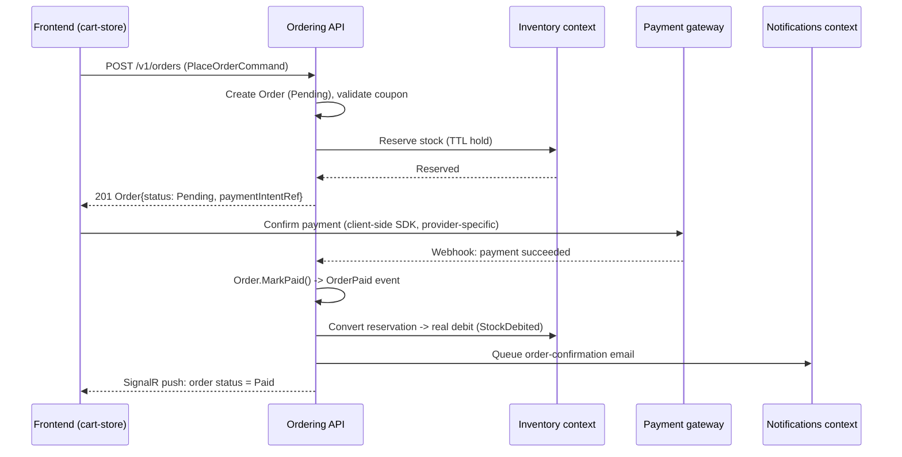
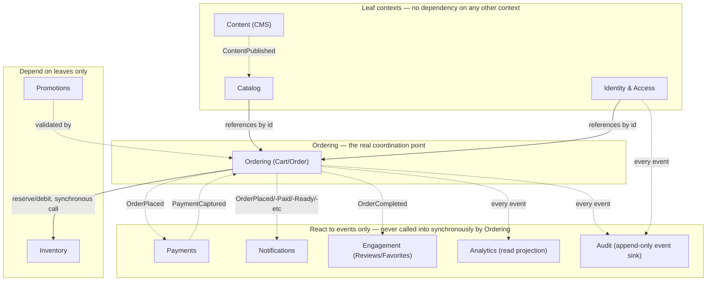

# 29 — Commerce Architecture Freeze

**Status**: Design freeze in effect. No production code written during this phase — verified via `git status` at the end, the same discipline [15_ARCHITECTURE_FREEZE.md](15_ARCHITECTURE_FREEZE.md) established.

An adversarial pass against [milestone-5-commerce-rfc.md](milestone-5-commerce-rfc.md) and [30_COMMERCE_DDD_MODEL.md](30_COMMERCE_DDD_MODEL.md): twelve concrete scenarios run through the design on paper, a dependency graph checked for cycles, failure modes analyzed for detection/recovery, and the DDD model's aggregate boundaries stress-tested for the one mistake that matters most — a command handler needing two aggregate roots from two contexts in one transaction. Four real issues were found; all four are resolved in [Final Review](#final-review).

## Scenario validation

### 1. Order placement — the full flow

| | |
|---|---|
| Contexts | Ordering (`Cart` → `Order`), Inventory (`InventoryItem`), Payments (`Payment`) |
| Contracts | `PlaceOrderCommand`, `CaptureOrderPaymentCommand`, `IInventoryReservation` (see below) |
| Events | `OrderPlaced` → (Inventory context handler) debits stock, raises `StockDebited` → (Payments context, triggered by frontend confirming payment intent) `PaymentCaptured` → (Ordering context handler) transitions `Order` to `Paid` |
| Cross-aggregate risk | **Real risk found**: naively, "place an order" looks like it should debit inventory and create the order atomically. It cannot — they're different aggregates in different contexts. |
| Resolution | Two-phase, not one transaction: (1) `PlaceOrderCommand` creates the `Order` in `Pending` and *reserves* (not yet debits) inventory via a short-lived `IInventoryReservation` (a Redis-backed hold with a TTL, not a domain aggregate — see [35_INFRASTRUCTURE_AND_DEPLOYMENT.md](35_INFRASTRUCTURE_AND_DEPLOYMENT.md)), inside one transaction scoped to the `Order` aggregate alone. (2) On `PaymentCaptured`, a domain event handler converts the reservation to a real `StockDebited` debit, inside a transaction scoped to `InventoryItem` alone. If payment never completes, the reservation simply expires (TTL) and stock is never actually debited — no compensating transaction needed, because nothing was ever permanently committed on the inventory side until payment succeeded. |
| Sequence | See below. |
| Architectural change | **None to the frozen DDD model** — this scenario is exactly what "one aggregate per transaction, coordinated by events" is designed for. The reservation mechanism is new, added to [30_COMMERCE_DDD_MODEL.md](30_COMMERCE_DDD_MODEL.md)'s Inventory section as a Final Review fix (below). |

### 2. Guest checkout

| | |
|---|---|
| Contexts | Ordering only — `Order.CustomerId` is nullable, `GuestContactInfo` (email, for the confirmation notification) is a value object on `Order` for the guest case |
| Architectural change | **None.** `Order` was already designed with an optional `UserId`, not a required one — validated by this scenario, not retrofitted. A guest `Order` cannot be queried back via `GET /v1/orders/me` (no identity to scope by) but *can* be looked up via its own order confirmation link (`GET /v1/orders/{id}?token=...`, a signed, single-purpose access token issued at order-placement time and emailed to the guest) — a real, deliberately separate access path, not an oversight. |

### 3. Coupon application at checkout

| | |
|---|---|
| Contexts | Promotions (`Coupon`), Ordering (`Order` line-item pricing) |
| Contracts | `PlaceOrderCommand` carries an optional `couponCode`; validated and priced server-side inside the same transaction that creates the `Order` — never trusting a client-computed discount |
| Architectural change | **None.** `Coupon` and `Order` are separate aggregates, but this is a **read**, not a write, on the `Coupon` side (checking validity, incrementing a redeemed-count) — a single transaction touching `Order` (write) and reading + incrementing `Coupon.RedemptionCount` (a small, isolated write) is acceptable here specifically because `Coupon`'s own invariant (`UsageLimit`) is what's being protected, and doing it in the same transaction as order creation is what prevents a race where two concurrent orders both redeem the last unit of a limited coupon. This is a deliberate, narrow exception to "one aggregate per transaction" — justified in the Final Review below, not silently allowed. |

### 4. Payment provider failure / retry

| | |
|---|---|
| Contexts | Payments |
| Contracts | `IPaymentProvider.CaptureAsync` (see [34_PAYMENTS_NOTIFICATIONS_SEARCH.md](34_PAYMENTS_NOTIFICATIONS_SEARCH.md)) |
| Architectural change | **None.** A failed capture raises `PaymentFailed`, the `Order` stays `Pending` (never transitions to `Paid` on a failure), and the frontend's existing checkout UI (already built to handle a "try again" path, since even a mocked checkout can fail validation today) retries by calling the same `PlaceOrderCommand`-adjacent capture endpoint again — idempotent via the Idempotency-Key convention in [31_COMMERCE_ENGINEERING_CONTRACTS.md](31_COMMERCE_ENGINEERING_CONTRACTS.md), so a retry after a network timeout (where the first attempt actually succeeded server-side) never double-charges. |

### 5. Customization consuming multiple ingredients

| | |
|---|---|
| Contexts | Ordering (`OrderLine.RecipeSelection`), Inventory |
| Contracts | `RecipeSelection` (the JSONB-stored mirror of `CustomizerSelection`) is expanded into a flat list of `IngredientId`s by an Inventory-context query handler at reservation time — Inventory never needs to understand what a "recipe" is, only "given this list of ingredient ids and quantities, reserve/debit them" |
| Architectural change | **None** — validated directly against [30_COMMERCE_DDD_MODEL.md](30_COMMERCE_DDD_MODEL.md)'s own explicit scope decision (Inventory tracks ingredients, not recipes). The translation from `RecipeSelection` to an ingredient-quantity list is an Ordering-context concern (it owns the shape), passed to Inventory as a plain list — Inventory's contract never grows a "understand recipes" responsibility. |

### 6. Admin publishes a CMS content change

| | |
|---|---|
| Contexts | Content (CMS write), Catalog/Storefront (CMS read, cached) |
| Contracts | `ContentPublished` event |
| Architectural change | **Real gap found and fixed**: naively, the storefront would read `ContentBlock` directly from PostgreSQL on every request — fine for a `Product`, wasteful for a homepage banner requested on every single storefront page load. **Fixed**: `ContentPublished` triggers a Redis cache write (the same Redis instance [35_INFRASTRUCTURE_AND_DEPLOYMENT.md](35_INFRASTRUCTURE_AND_DEPLOYMENT.md) already provisions for catalog/search caching); storefront reads hit Redis first, fall back to PostgreSQL only on a cache miss, exactly the same read-through pattern the Catalog context already needs for `Product` listings — one caching convention, two consumers, not two. |

### 7. AI Barista conversation persistence for an authenticated user

| | |
|---|---|
| Contexts | Identity (who), a **new**, small `ConversationHistory` aggregate inside the AI Barista's own context (not modeled as part of any context above — it's genuinely new scope, not a fit for Ordering/Catalog/Engagement) |
| Frontend | `POST /api/ai-barista/chat` (the existing Next.js Route Handler, Sprint 3.9, **unchanged**) gains one additive behavior: if the request carries a valid session cookie/bearer token, it also calls a new backend endpoint to append the turn to that user's `ConversationHistory`; anonymous requests skip this call entirely and behave exactly as today |
| Architectural change | **None to any existing aggregate.** `ConversationHistory` is new, small, and intentionally has no relationship to `Order`/`Product`/etc. beyond referencing `UserId` and, optionally, the `ProductId` a recommendation resolved to (for analytics — see scenario 12's cousin below). The Ollama call itself stays entirely client-adjacent (the Next.js route talks to Ollama directly, exactly as Sprint 3.9 built it) — the backend never proxies or stores the LLM call itself, only the resulting conversation turns, keeping the ASP.NET Core backend from ever needing to know Ollama exists. |

### 8. Real-time order status push

| | |
|---|---|
| Contexts | Ordering (event source), a SignalR hub (presentation-layer, not a domain concern) |
| Contracts | `OrderStatusHub` broadcasts to a group keyed by `OrderId` (guest-accessible via the same signed token from scenario 2) or `UserId` (authenticated) |
| Architectural change | **None to the domain layer.** The hub is a pure event-to-websocket bridge subscribing to the same domain events (`OrderPaid`, `OrderPreparing`, `OrderReady`, ...) every other consumer (Notifications, Analytics, Audit) already subscribes to via the outbox — see [32_COMMERCE_EVENT_CATALOG.md](32_COMMERCE_EVENT_CATALOG.md). The frontend's existing order-history UI (`features/cart/`) gains a SignalR client that's additive and degrades to its current behavior (a manual refresh / re-fetch) if the connection can't be established — never a hard dependency, matching the RFC's own "additive, never gating" integration rule. |

### 9. Catalog search at scale

| | |
|---|---|
| Contexts | Catalog (read side) |
| Contracts | `SearchProductsQuery` — a CQRS query, initially backed by PostgreSQL full-text search (`tsvector`/`tsquery`) + trigram indexes for fuzzy matching, **not** Elasticsearch on day one |
| Architectural change | **None required now, one real deferred decision named explicitly.** The brief asks for a "future Elastic-compatible interface" — satisfied by defining `ISearchService` (query in, ranked `ProductId`s out) as the contract every consumer (the REST endpoint, a future admin search box) depends on, with a PostgreSQL-backed implementation today. Swapping to Elasticsearch later is a new `ISearchService` implementation registered in DI — zero change to any consumer. **Not built speculatively**: no Elasticsearch container, index, or client library is added in Phase 0 or Sprint 5.2, since PostgreSQL full-text search is genuinely sufficient at this project's real catalog size (dozens to low hundreds of products), and adding a second search engine nobody's scale requires yet would be exactly the speculative infrastructure [17_ZERO_REWRITE_POLICY.md](17_ZERO_REWRITE_POLICY.md)'s Architectural Maturity Rule warns against. |

### 10. Refund flow

| | |
|---|---|
| Contexts | Payments (`Payment.Refund()`), Ordering (`Order` → `Refunded`), Inventory (optional restock) |
| Architectural change | **None** — same event-coordination shape as scenario 1, in reverse. `RefundCommand` (admin-initiated, see [34_PAYMENTS_NOTIFICATIONS_SEARCH.md](34_PAYMENTS_NOTIFICATIONS_SEARCH.md)) calls `IPaymentProvider.RefundAsync`, raises `PaymentRefunded`, which a handler in Ordering consumes to transition `Order.Refunded()`. Restocking is a **policy decision, not an architectural one** — modeled as an optional flag on the refund command (`restock: bool`), defaulting to `false` (a used/prepared drink is rarely restockable) — left to Sprint 5.3's actual implementation to wire the default correctly per the real business rule, not decided in this design-only phase. |

### 11. Multi-device sessions / refresh token rotation

| | |
|---|---|
| Contexts | Identity |
| Architectural change | **None** — validated directly against [30_COMMERCE_DDD_MODEL.md](30_COMMERCE_DDD_MODEL.md)'s `User` aggregate, which already models `RefreshToken` as a one-to-many entity, one per device/session, each independently revocable. Logging out one device revokes exactly one `RefreshToken`; "log out everywhere" (a real, named security-events requirement) revokes all of a `User`'s tokens in one aggregate method call — still a single-aggregate transaction, no cross-context concern. |

### 12. Rate limiting under abuse / bot traffic

| | |
|---|---|
| Contexts | Cross-cutting — not domain, a Presentation-layer/middleware concern |
| Contracts | ASP.NET Core's built-in rate-limiting middleware, Redis-backed counters for a multi-instance deployment (an in-memory counter would be per-instance and useless behind a load balancer — see [35_INFRASTRUCTURE_AND_DEPLOYMENT.md](35_INFRASTRUCTURE_AND_DEPLOYMENT.md)) |
| Architectural change | **None to the domain.** Rate limiting is applied at the API Gateway/middleware layer, never inside a command handler — a rate-limited request never reaches MediatR at all. This keeps "is this request allowed to happen" (infrastructure concern) cleanly separate from "is this command valid" (FluentValidation) and "does this command violate a domain invariant" (the aggregate itself) — three layers, three distinct kinds of rejection, never conflated. See [36_SECURITY_MODEL.md](36_SECURITY_MODEL.md). |

## Dependency graph

Bounded-context level, not a literal project-reference graph (no code exists yet). Arrows are "depends on / calls into," dashed arrows are "reacts to an event from" (no direct dependency).

**The one real synchronous dependency**: Ordering → Inventory (reserve/debit) is the single place one bounded context calls directly into another rather than reacting to an event, because inventory reservation genuinely must happen *before* an `Order` can be confirmed to the customer (you cannot sell what you don't have) — an eventual-consistency approach here would let an order succeed against stock that's already gone. This is named and justified explicitly, not an accidental coupling: it's a synchronous call across a well-defined `IInventoryReservation` contract (Inventory's own public interface), never a reach into Inventory's `DbContext` or aggregate internals.

## Failure modes

| Failure | Detection | Recovery | Customer experience | Logging |
|---|---|---|---|---|
| Payment gateway timeout mid-capture | `IPaymentProvider.CaptureAsync` throws / times out | Order stays `Pending`; the Idempotency-Key convention means a client retry either safely re-attempts or discovers the first attempt actually succeeded, never double-charges | "Payment is taking longer than expected, we'll confirm shortly" — never a silent failure or a duplicate charge | Full request/response logged (minus card data — see [36_SECURITY_MODEL.md](36_SECURITY_MODEL.md)), correlated by trace id (OpenTelemetry) |
| Inventory reservation expires before payment completes | TTL elapses in Redis | The order-confirmation step re-validates stock before finalizing; if unavailable, the customer is prompted to adjust the order rather than silently charged for something no longer available | A real, honest "this item just sold out" message, not a silent order failure | Reservation-expiry events logged for demand-forecasting signal |
| Domain event handler fails after the triggering transaction committed (e.g. Notifications is down when `OrderPlaced` fires) | The outbox pattern's own delivery-confirmation loop (see [32_COMMERCE_EVENT_CATALOG.md](32_COMMERCE_EVENT_CATALOG.md)) | The event is retried from the outbox table, not lost — the triggering `Order` write already committed independently of any handler succeeding | The order itself is unaffected; the customer may see a delayed confirmation email, never a failed order | Failed/retried outbox deliveries logged and alertable |
| Two concurrent requests redeem the last unit of a limited coupon | PostgreSQL's own row-level locking / optimistic concurrency token on `Coupon.RedemptionCount` | The losing transaction retries against the now-current count and correctly finds the limit exhausted | The second customer sees "this coupon just reached its usage limit," not a silently-double-honored discount | Concurrency conflicts logged, expected under load, not treated as an error-rate alert trigger on their own |
| A malformed/forged JWT reaches the API | ASP.NET Core's built-in JWT bearer validation (signature, expiry, issuer/audience) | 401, request never reaches a handler | Standard "please log in again" | Failed auth attempts logged as a security event — see [36_SECURITY_MODEL.md](36_SECURITY_MODEL.md) |
| Redis unavailable | Connection failures on cache read/write | Read-through cache degrades to direct PostgreSQL reads (slower, never broken); rate-limiting middleware fails closed on a stricter default rather than open, a deliberate security-over-availability choice for that one subsystem — see [36_SECURITY_MODEL.md](36_SECURITY_MODEL.md) | Slower page loads under a Redis outage, never a 500 | Redis connection failures logged and alertable — a real degraded-mode, not a silent one |
| Database migration fails mid-deploy | EF Core migration apply step fails | Deploy pipeline halts before the new application version receives traffic (see [35_INFRASTRUCTURE_AND_DEPLOYMENT.md](35_INFRASTRUCTURE_AND_DEPLOYMENT.md)'s deployment strategy) — the old version keeps serving | No customer-visible impact from a failed migration attempt | Migration failure is a deploy-pipeline-level alert, not a runtime log |

## Extensibility review

| Feature | What gets added | Contexts touched |
|---|---|---|
| A new payment gateway (e.g. Apple Pay via a new provider) | A new `IPaymentProvider` implementation, registered in DI | None — `Payment` aggregate and every command/handler are provider-agnostic by construction |
| A seasonal promotion type (e.g. "buy 2 get 1") | A new `DiscountRule` union member | Promotions only — `Coupon`'s aggregate logic already branches on the closed union |
| A new notification channel (SMS alongside email) | A new `INotificationChannel` implementation | Notifications only |
| A new CMS content type (e.g. a "seasonal menu" block) | A new `ContentType` enum member | Content only — `ContentBlock`'s generic shape already supports it |
| Loyalty points | A new, small bounded context reacting to `OrderCompleted` | New context; zero change to Ordering, which doesn't know loyalty exists — the same "compose via events, don't couple" pattern every scenario above already relies on |

All five hold without touching a frozen aggregate's own logic — the backend's version of [15_ARCHITECTURE_FREEZE.md](15_ARCHITECTURE_FREEZE.md)'s own extensibility review passing cleanly.

## Final review

Four real issues surfaced by the stress test above. All four are design-only fixes, folded into [30_COMMERCE_DDD_MODEL.md](30_COMMERCE_DDD_MODEL.md) and [32_COMMERCE_EVENT_CATALOG.md](32_COMMERCE_EVENT_CATALOG.md):

1. **Inventory reservation needed a real mechanism, not just a description.** Scenario 1 revealed that "debit inventory when an order is placed" is wrong — it must be a *reservation* first, converted to a debit only on payment success, or a failed payment leaves phantom stock debits. **Fixed**: `IInventoryReservation`, a Redis-backed TTL hold, added to [30_COMMERCE_DDD_MODEL.md](30_COMMERCE_DDD_MODEL.md)'s Inventory section.
2. **Coupon redemption is a deliberate, narrow exception to "one aggregate per transaction."** Named and justified explicitly in scenario 3 rather than left as a silent violation of the model's own stated rule — the alternative (eventual consistency for coupon-limit enforcement) would allow real over-redemption under concurrent load, which the business impact doesn't justify tolerating the way an eventually-consistent inventory count might.
3. **CMS content needed a caching story from the start**, not bolted on after a real performance problem — scenario 6's read-through Redis cache is now the documented pattern for both Content and Catalog reads, one convention, not two.
4. **AI Barista conversation persistence needed its own small aggregate**, not a forced fit into an existing context — scenario 7 confirms `ConversationHistory` as new, deliberately minimal scope, explicitly not part of Ordering/Catalog/Engagement.

No bounded context was found over-coupled, and the one real synchronous cross-context call (Ordering → Inventory) is justified and documented, not accidental. The Analytics/Audit contexts' "pure read projection, zero write-path involvement" design is validated by every scenario above needing zero special-casing for them — they simply subscribe to the same event stream everything else does.

## Related

[milestone-5-commerce-rfc.md](milestone-5-commerce-rfc.md) · [30_COMMERCE_DDD_MODEL.md](30_COMMERCE_DDD_MODEL.md) · [31_COMMERCE_ENGINEERING_CONTRACTS.md](31_COMMERCE_ENGINEERING_CONTRACTS.md) · [32_COMMERCE_EVENT_CATALOG.md](32_COMMERCE_EVENT_CATALOG.md) · [38_COMMERCE_RISK_REGISTER.md](38_COMMERCE_RISK_REGISTER.md)
