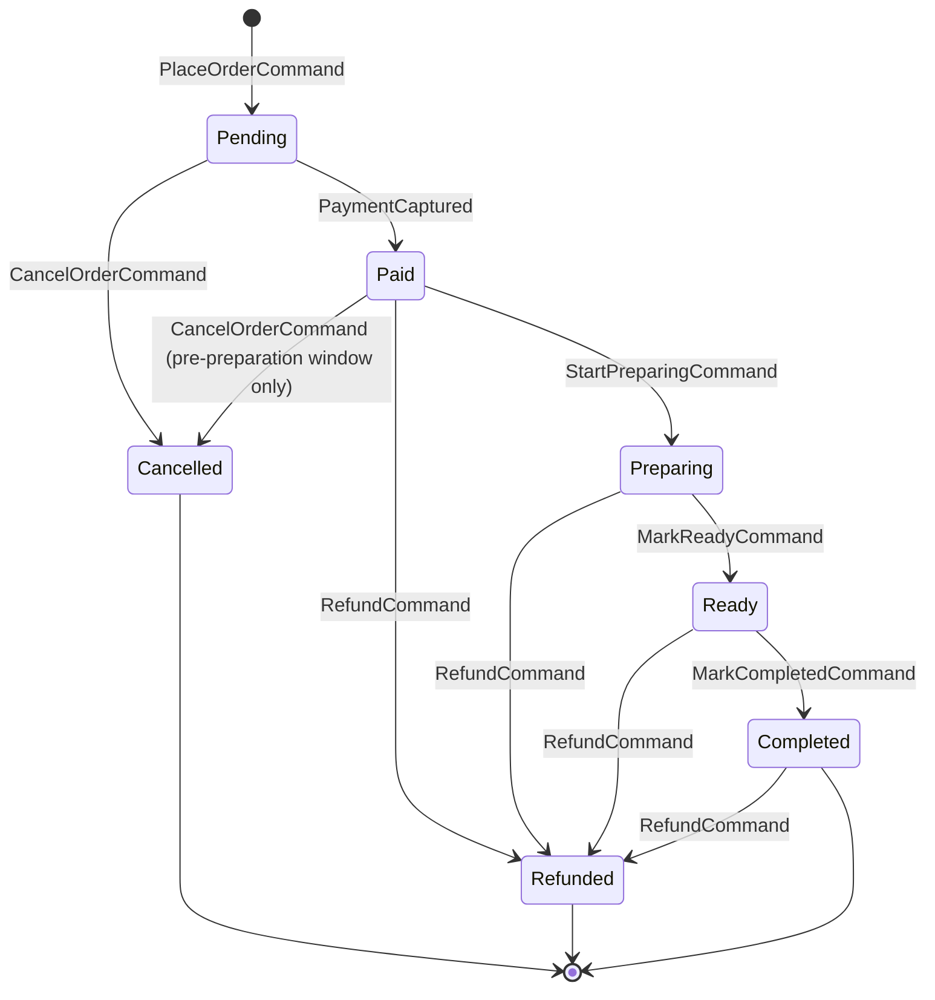

# 30 — Commerce DDD Model

Phase 0 deliverable. Every bounded context's aggregates, entities, value objects, invariants, and domain events, frozen before Sprint 5.1 begins — the backend's equivalent of [22_MANAGER_INTERFACES.md](22_MANAGER_INTERFACES.md). An **aggregate root** is the only entity a repository loads/saves directly; everything inside it is reached only through it, and every invariant that must hold *within* the aggregate is enforced by its own methods, never by a caller reaching in and setting a field.

## Convention, stated once

- **Entity**: has identity (a `Guid` id) and a lifecycle; equality is by id.
- **Value Object**: no identity; equality is by value; immutable (a `record` in C#, not a mutable class). `Money`, `Address`, `Email` — never entities, never given an id just because "it might need one later" (that's speculative abstraction, the same rule [17_ZERO_REWRITE_POLICY.md](17_ZERO_REWRITE_POLICY.md) already forbids on the frontend).
- **Aggregate root**: the entity a repository is defined against. Cross-aggregate references are always by id (`CustomerId`, never a navigation property to the actual `Customer` aggregate) — this is the mechanical rule that keeps aggregates independently loadable and prevents the "load the whole graph" anti-pattern EF Core makes easy to fall into by accident.
- **Domain event**: something that happened, named in the past tense, raised by an aggregate method and dispatched *after* the transaction that produced it commits (never before — a rolled-back transaction must never have raised an event nobody undoes). Full catalog: [32_COMMERCE_EVENT_CATALOG.md](32_COMMERCE_EVENT_CATALOG.md).

## Bounded context: Identity & Access

| | |
|---|---|
| Aggregate root | `User` |
| Entities (inside the aggregate) | `RefreshToken` (a `User` may hold several, one per active device/session) |
| Value objects | `Email` (validated format, normalized lowercase), `HashedPassword` (never a plain string — the type itself only constructible via the hashing service), `FullName` |
| Invariants | An `Email` is unique across all `User`s (enforced by a unique index, not just application logic — see [31_COMMERCE_ENGINEERING_CONTRACTS.md](31_COMMERCE_ENGINEERING_CONTRACTS.md)'s concurrency notes). A `RefreshToken` is single-use — redeeming one revokes it and issues a new one in the same operation (rotation), closing the replay window a static long-lived refresh token would leave open. A `User` cannot authenticate until `EmailVerified` is true, *except* the flows that don't require it (guest checkout never touches this aggregate at all). |
| Roles/Permissions | `Role` and `Permission` are a **separate, small aggregate** (`RoleDefinition`), not entities inside `User` — a permission model that changes (a new permission added to a role) must never require loading and re-saving every user who holds that role. `User` holds only `RoleId`s (a value object list), resolved against `RoleDefinition` at authorization time. See [33_AUTH_ARCHITECTURE.md](33_AUTH_ARCHITECTURE.md). |
| Domain events | `UserRegistered`, `EmailVerified`, `PasswordResetRequested`, `PasswordChanged`, `UserLoggedIn` (a security event, not just telemetry — see [36_SECURITY_MODEL.md](36_SECURITY_MODEL.md)), `RefreshTokenRevoked` |

## Bounded context: Catalog

| | |
|---|---|
| Aggregate roots | `Product`, `Ingredient`, `Category` — three separate aggregates, not one "Catalog" god-aggregate. A `Product` references `CategoryId`/compatible `IngredientId`s by id, never by embedding the full `Category`/`Ingredient` — a category rename must never require touching every product row in the same transaction. |
| Entities | `ProductVariant` (inside `Product` — e.g. size; has its own price delta, no independent lifecycle outside its parent) |
| Value objects | `Money` (`decimal Amount` + `Currency`, arithmetic operators defined once, used everywhere money is touched — the backend's equivalent of never hand-rolling a second color-conversion function), `Price` (a `Money` plus an optional `CompareAtMoney` for "was/now" display), `Sku`, `ProductTag` |
| Invariants | A `Product`'s base price is always > 0. A discontinued `Product` (`IsActive = false`) cannot be added to a new order, but existing `RecipeSnapshot`-equivalent order lines that already reference it remain valid — **exactly the same "denormalize at snapshot time" rule** `features/cart/types.ts`'s `RecipeSnapshot.baseDrinkName`/`unitPrice` already established on the frontend, now mirrored server-side (see [31_COMMERCE_ENGINEERING_CONTRACTS.md](31_COMMERCE_ENGINEERING_CONTRACTS.md)'s `OrderLine` shape). An `Ingredient`'s `CompatibleCategories` set mirrors `features/composer/data/ingredients.ts`'s existing `compatibleWith` field exactly — the frontend's compatibility rules were already correct; this migration copies the *data*, not the *rule*, into a real table. |
| Domain events | `ProductCreated`, `ProductPriceChanged`, `ProductDiscontinued`, `IngredientCreated`, `CategoryCreated` |

## Bounded context: Inventory

| | |
|---|---|
| Aggregate root | `InventoryItem` (one per `Ingredient`, or per `Product` for non-composable items — a coffee shop's real constraint is usually ingredient-level, not finished-drink-level, since a "Latte" and a "Cappuccino" both consume the same milk) |
| Value objects | `StockQuantity` (never negative — a domain invariant, not just a UI clamp), `ReorderThreshold` |
| Invariants | `StockQuantity` cannot go negative; a debit that would make it negative is rejected by the aggregate method itself (`Debit(quantity)` throws a domain exception), not caught by a caller checking first — preventing the classic check-then-act race under concurrent orders (see [31_COMMERCE_ENGINEERING_CONTRACTS.md](31_COMMERCE_ENGINEERING_CONTRACTS.md)'s optimistic-concurrency note). |
| Domain events | `StockDebited`, `StockReplenished`, `LowStockThresholdCrossed` (drives a notification, see [34_PAYMENTS_NOTIFICATIONS_SEARCH.md](34_PAYMENTS_NOTIFICATIONS_SEARCH.md)) |
| A deliberate scope decision | Inventory tracks *ingredients*, not a literal 1:1 mirror of every `ProductVariant`. Composing a "what does completing this order consume" projection is an `Order`-side responsibility (reads `OrderLine.Selection`, the same `CustomizerSelection`-shaped JSON the frontend already produces) — Inventory itself stays a flat, simple ledger per stocked item, not a second copy of the product composition model. See [29_COMMERCE_ARCHITECTURE_FREEZE.md](29_COMMERCE_ARCHITECTURE_FREEZE.md) scenario 4. |

## Bounded context: Ordering

| | |
|---|---|
| Aggregate roots | `Cart`, `Order` — deliberately **separate aggregates**, not one with a status flag. A `Cart` is mutable, ephemeral, cheap to abandon; an `Order` is immutable-once-placed except for its own lifecycle transitions. Converting a `Cart` to an `Order` is an explicit application-service operation (`PlaceOrderCommand`), not a state transition inside one aggregate — this is the single most important boundary decision in this whole model, stress-tested in [29_COMMERCE_ARCHITECTURE_FREEZE.md](29_COMMERCE_ARCHITECTURE_FREEZE.md) scenario 1. |
| Entities | `CartLine` / `OrderLine` (inside their respective roots) |
| Value objects | `RecipeSelection` (a direct, intentional mirror of the frontend's existing `CustomizerSelection` shape — see [31_COMMERCE_ENGINEERING_CONTRACTS.md](31_COMMERCE_ENGINEERING_CONTRACTS.md), stored as JSONB, not decomposed into relational columns — it has no query requirements of its own beyond "redisplay exactly what was ordered," the same reasoning `RecipeSnapshot` already applies client-side), `OrderStatus` (a closed enum, not a free string — see the state machine below), `DeliveryAddress`, `GuestContactInfo` (email only, for the order-confirmation notification — present when `CustomerId` is null, see the Guest checkout row below) |
| Invariants | An `Order`'s status only moves forward through its defined transitions (below) — never backward, never skips a step except the two explicitly-modeled exceptions (`Cancelled`, `Refunded`, both reachable from multiple prior states). An `Order`'s line items and total are immutable once `Paid` — a price change to the underlying `Product` after that point never retroactively changes an already-placed order, mirroring the frontend's own `RecipeSnapshot` denormalization. A `Cart` cannot be converted to an `Order` if it's empty. An `Order` carries exactly one identity path — a non-null `CustomerId` (authenticated) or a non-null `GuestContactInfo` (guest), never both null and never both populated — enforced in the aggregate's own construction, not left to callers ([29_COMMERCE_ARCHITECTURE_FREEZE.md](29_COMMERCE_ARCHITECTURE_FREEZE.md) scenario 2). |
| Order status state machine | `Pending → Paid → Preparing → Ready → Completed`, with `Cancelled` reachable from `Pending`/`Paid` and `Refunded` reachable from `Paid`/`Preparing`/`Ready`/`Completed` — matching the brief's own named states exactly |
| Domain events | `CartItemAdded`, `CartItemRemoved`, `OrderPlaced`, `OrderPaid`, `OrderPreparing`, `OrderReady`, `OrderCompleted`, `OrderCancelled`, `OrderRefunded` |

## Bounded context: Promotions

| | |
|---|---|
| Aggregate root | `Coupon` |
| Value objects | `DiscountRule` (a closed union: `Percentage`, `FixedAmount`, `FreeItem`, `FreeDelivery` — the same discriminated-union discipline `EffectConfig` already established on the frontend, never a boolean-soup of `isPercentage`/`isFixed`/... fields), `UsageLimit` (per-coupon total, and optionally per-customer) |
| Invariants | A `Coupon` cannot apply if `Now > ExpiresAt`, if its `UsageLimit` is exhausted, or if the cart subtotal is below its `MinimumSpend`. Applying a coupon is validated at `PlaceOrderCommand` time against the *current* cart, never trusted from client-supplied state — the discount amount the client displayed is a preview, the server always recomputes it authoritatively. |
| Domain events | `CouponCreated`, `CouponRedeemed`, `CouponExpired` |

## Bounded context: Payments

| | |
|---|---|
| Aggregate root | `Payment` (one per `Order`, referencing `OrderId` by value, never holding a navigation property back into the `Order` aggregate — payments and orders are separate bounded contexts communicating via domain events, exactly as [29_COMMERCE_ARCHITECTURE_FREEZE.md](29_COMMERCE_ARCHITECTURE_FREEZE.md) scenario 1 requires) |
| Value objects | `Money`, `PaymentProviderReference` (the opaque id a gateway gives back — Stripe's `PaymentIntent` id, Paymob's transaction id — stored as a string, never parsed/relied on for shape by domain code) |
| Invariants | A `Payment` is captured at most once per attempt; a second capture attempt against an already-captured `Payment` is a no-op, not a double charge (idempotency — see [31_COMMERCE_ENGINEERING_CONTRACTS.md](31_COMMERCE_ENGINEERING_CONTRACTS.md)'s Idempotency-Key convention, which this aggregate's own application-service layer enforces before ever calling the gateway). |
| Domain events | `PaymentCaptured`, `PaymentFailed`, `PaymentRefunded` |
| Provider abstraction | `Payment` never depends on a specific gateway's SDK types — see [34_PAYMENTS_NOTIFICATIONS_SEARCH.md](34_PAYMENTS_NOTIFICATIONS_SEARCH.md)'s `IPaymentProvider` contract. |

## Bounded context: Engagement (Reviews & Favorites)

| | |
|---|---|
| Aggregate roots | `Review`, `Favorite` |
| Value objects | `Rating` (1–5, an integer value object, not a bare `int` — invalid ratings are unrepresentable, not just unvalidated) |
| Invariants | A `Review` requires a `UserId` who has a `Completed` order containing the reviewed `ProductId` — "verified purchase" enforced at the domain layer, not a UI-only badge. A `Favorite` is a simple `(UserId, ProductId)` pair with no independent lifecycle beyond existing/not-existing — deliberately not over-modeled. |
| Domain events | `ReviewSubmitted`, `FavoriteAdded`, `FavoriteRemoved` |

## Bounded context: Notifications

| | |
|---|---|
| Aggregate root | `NotificationRequest` — a queued intent to notify, not the notification channel itself |
| Value objects | `NotificationTemplate` (a template key + parameters, never a hand-built string at the call site — mirrors the frontend's own "no duplicated values outside tokens" discipline, applied to copy instead of colors) |
| Invariants | A `NotificationRequest` records its own delivery outcome (`Sent`/`Failed`/`Retrying`) — never fire-and-forget with no record, since "did the password-reset email actually go out" is a real support question this model must be able to answer. |
| Domain events | `NotificationQueued`, `NotificationSent`, `NotificationFailed` |
| Provider abstraction | See [34_PAYMENTS_NOTIFICATIONS_SEARCH.md](34_PAYMENTS_NOTIFICATIONS_SEARCH.md)'s `IEmailProvider`. |

## Bounded context: Content (CMS)

| | |
|---|---|
| Aggregate roots | `ContentBlock` (a generic, typed-by-`ContentType` block — `HomepageBanner`, `StoryChapterContent`, `FaqEntry`, `AiPromptTemplate`), each a thin wrapper, not five separate near-identical aggregates | 
| Value objects | `ContentType` (closed enum), `LocalizedText` (reserved shape for future i18n — a single-locale record today, structured so a future locale dimension is additive, not a schema rewrite; not built speculatively beyond this shape decision, per [17_ZERO_REWRITE_POLICY.md](17_ZERO_REWRITE_POLICY.md)'s anti-speculation half) |
| Invariants | A `ContentBlock` has at most one `Published` version live per `(ContentType, Key)` pair at a time; draft/publish is a real two-state flow (`Draft`/`Published`), not "whatever's in the table is live" |
| Domain events | `ContentPublished`, `ContentUnpublished` |
| Why this exists at all | "No hardcoded content," the brief's own words — `features/storytelling/data/chapters.ts`'s narrative copy, `features/onboarding/data/steps.ts`'s tour copy, and the AI Barista's system prompt (`features/ai-barista/lib/promptBuilder.ts`'s `AI_BARISTA_SYSTEM_PROMPT`) all become CMS-editable. The frontend's own data files become the *seed*/*fallback*, not the source of truth — see [31_COMMERCE_ENGINEERING_CONTRACTS.md](31_COMMERCE_ENGINEERING_CONTRACTS.md)'s seed-data strategy. |

## Bounded context: Platform (Analytics, Audit, Settings, Media)

| | |
|---|---|
| Aggregate roots | `AuditLogEntry` (append-only — no update/delete repository methods exist for this aggregate, enforced at the repository interface level, not just convention), `SettingEntry` (a typed key-value store for runtime-configurable, non-content settings — feature flags, tax rate, delivery radius), `MediaAsset` (metadata row pointing at a Cloudinary-hosted asset — see [34_PAYMENTS_NOTIFICATIONS_SEARCH.md](34_PAYMENTS_NOTIFICATIONS_SEARCH.md)'s `IBlobStorageProvider`) |
| Analytics | Deliberately **not** an aggregate/write model at all — analytics is a read-side projection over domain events (`OrderPlaced`, `ProductViewed`, etc.), materialized into Redis-cached rollups and/or dedicated read tables by background jobs, never a write-path concern any command handler touches directly. See [32_COMMERCE_EVENT_CATALOG.md](32_COMMERCE_EVENT_CATALOG.md) and [34_PAYMENTS_NOTIFICATIONS_SEARCH.md](34_PAYMENTS_NOTIFICATIONS_SEARCH.md). |
| Invariants | An `AuditLogEntry` is immutable once written — `Actor`, `Action`, `EntityType`, `EntityId`, `Timestamp`, `Payload` (a JSONB snapshot of what changed), never edited or deleted, including by admins. |
| Domain events | Audit/Settings/Media deliberately do **not** raise their own domain events for consumption elsewhere — `AuditLogEntry` *is itself* a consumer of every other context's events (see [32_COMMERCE_EVENT_CATALOG.md](32_COMMERCE_EVENT_CATALOG.md)), not a producer; raising `AuditEntryCreated` events about audit entries would be a real, pointless cycle. |

## Cross-aggregate rule, stated once

No command handler ever loads and saves two aggregate roots from two different bounded contexts in one database transaction. Where a real-world operation looks like it needs to (placing an order needs to debit inventory *and* create the order), the two operations happen as two separate transactions coordinated by domain events and the outbox pattern — see [32_COMMERCE_EVENT_CATALOG.md](32_COMMERCE_EVENT_CATALOG.md)'s "Order placement, worked example" and [29_COMMERCE_ARCHITECTURE_FREEZE.md](29_COMMERCE_ARCHITECTURE_FREEZE.md) scenario 1's full sequence diagram. This is DDD's own well-established rule ("one aggregate per transaction"), restated here as this project's own frozen contract because violating it is the single most common way a DDD design silently degrades into an anemic, tightly-coupled one over time.

## Related

[milestone-5-commerce-rfc.md](milestone-5-commerce-rfc.md) · [29_COMMERCE_ARCHITECTURE_FREEZE.md](29_COMMERCE_ARCHITECTURE_FREEZE.md) · [31_COMMERCE_ENGINEERING_CONTRACTS.md](31_COMMERCE_ENGINEERING_CONTRACTS.md) · [32_COMMERCE_EVENT_CATALOG.md](32_COMMERCE_EVENT_CATALOG.md) · [adr/0010-backend-clean-architecture-ddd-cqrs.md](adr/0010-backend-clean-architecture-ddd-cqrs.md)
