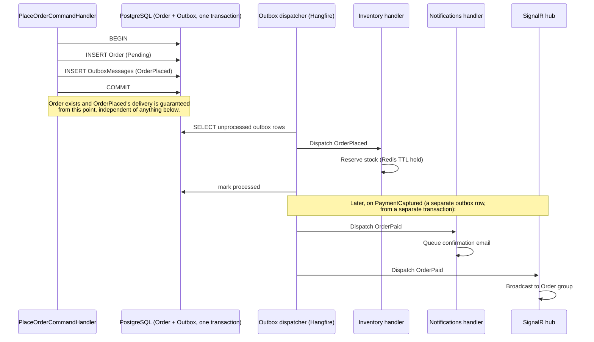

# 32 — Commerce Event Catalog

Phase 0 deliverable. Every domain event named in [30_COMMERCE_DDD_MODEL.md](30_COMMERCE_DDD_MODEL.md), frozen with its payload shape and consumers — the backend's equivalent of [19_EVENT_CATALOG.md](19_EVENT_CATALOG.md), same discipline: named and typed here first, a new event is a row added to this table, never an ad hoc `_eventBus.Publish()` call invented at the point of need.

## The outbox pattern — how events actually get delivered

A domain event raised by an aggregate inside a transaction is **not** published directly (an in-process pub/sub call inside the same transaction that raised it would either (a) run before the transaction commits, meaning a consumer could react to something that then gets rolled back, or (b) require a distributed transaction across the event bus and the database, which PostgreSQL/an in-process bus don't share). Instead:

1. The aggregate method raises the event into an in-memory list on the aggregate (`AggregateRoot.DomainEvents`).
2. On `SaveChangesAsync`, EF Core's interceptor serializes every pending domain event into an **outbox table** (`OutboxMessages`: `Id, EventType, Payload (JSONB), OccurredAt, ProcessedAt (nullable)`) in the **same transaction** as the aggregate's own state change — so the event's existence is exactly as durable as the state change that caused it, atomically, by construction.
3. A background job (Hangfire, polling every few seconds — see [35_INFRASTRUCTURE_AND_DEPLOYMENT.md](35_INFRASTRUCTURE_AND_DEPLOYMENT.md)) reads unprocessed outbox rows, dispatches them to in-process MediatR notification handlers (same-process consumers: Notifications, Analytics, Audit) and/or a message broker topic (for anything that needs to survive an app restart mid-processing), then marks them processed.

This is what makes [29_COMMERCE_ARCHITECTURE_FREEZE.md](29_COMMERCE_ARCHITECTURE_FREEZE.md)'s failure mode table honest: "a handler fails after the triggering transaction committed" is recoverable *because* the outbox row already durably exists independent of any handler succeeding — retrying means re-reading the same row, not reconstructing what should have happened from partial state.

**Implementation status, Sprint 5.1**: the `outbox_messages` table and the publish-side mechanism (`DomainEventsToOutboxInterceptor`, draining every tracked aggregate's pending events into a row in the same `SaveChangesAsync` call) are real and live — every event `User` raises this sprint lands there. The Hangfire polling dispatcher that reads and processes those rows is not yet built — correctly deferred, since a fresh Identity context has no other bounded context to notify yet (Sprint 5.1 has zero real event *consumers*). Outbox rows accumulate, unprocessed, until Sprint 5.3+ builds the dispatcher alongside its first real consumer. This is a known, deliberate gap, not an oversight — [39_COMMERCE_IMPLEMENTATION_READINESS.md](39_COMMERCE_IMPLEMENTATION_READINESS.md) tracks when the dispatcher lands.

**Implementation status, Sprint 5.2**: the same interceptor picks up every Catalog event below for free — `Product`/`Category`/`Ingredient` all implement `IHasDomainEvents` via the same `AggregateRoot`/`Entity` base Sprint 5.1's `User` uses, so no new plumbing was needed, only the aggregate methods raising the right event at the right point (verified live: every event row above was confirmed present in `outbox_messages` after exercising the real Catalog admin flows end-to-end, not assumed from reading the code). The dispatcher gap above is unchanged — these rows accumulate unprocessed too, for the same reason.

**Implementation status, Sprint 5.3**: same story again — `Order : AuditableEntity<Guid> : AggregateRoot<Guid>` gets outbox delivery for free, zero new plumbing, only `Order`'s own methods raising the right event (verified live the same way Sprint 5.2 was: every row in the real Ordering event set below was confirmed present in `outbox_messages` after exercising the full create → submit → pay → complete, and separately → cancel, and separately → fail lifecycles end-to-end against the real API and database during Phase 4's manual verification). The dispatcher gap is still unchanged — Ordering has zero real event *consumers* yet either, same as Identity in Sprint 5.1.

**Implementation status, Sprint 5.4**: `InventoryItem`/`InventoryReservation` get outbox delivery the same free way — every row in the new Inventory event set below was confirmed present in `outbox_messages` after exercising create → reserve → consume, and separately → release, and separately restock/adjust/mark-out-of-stock flows end-to-end against the real API and database. **A real, deliberate deviation from this document's own worked example below**: Inventory does **not** react to `OrderSubmitted` (or `OrderCancelled`/`OrderPaid`/`OrderFailed`) through the outbox dispatcher at all — `IInventoryReservationCoordinator` is called *directly, synchronously, inside the same handler and the same database transaction* as the Order mutation that triggers it (`CreateOrderFromCartCommandHandler` reserves before adding the order; `Cancel`/`Pay`/`Fail` release or consume right after their own state transition). See `IInventoryReservationCoordinator`'s own doc comment for the full reasoning: the outbox/dispatcher path is for *eventually*-consistent, cross-transaction reactions (Notifications, Analytics, Audit — real future consumers of `OrderSubmitted` etc.), but "does this order actually have the stock it needs" has to be answered *before* the order is allowed to exist at all, which only a same-transaction call can guarantee. The `OrderSubmitted`/`OrderCancelled`/`OrderPaid`/`OrderFailed` rows below are updated to reflect this — their outbox rows still exist and are still real (Analytics/Audit/Notifications can consume them once the dispatcher is built), but "Inventory" is removed from their consumers column since Inventory never reads them.

A note on two names from Sprint 5.2's own brief that deliberately **don't** appear as new rows above: `search:performed` has no backend aggregate to raise it from (searching mutates nothing) and is already covered, unchanged, by the frontend's own `menu_searched` analytics event (`engine/analytics/events.ts`) — that event's *meaning* didn't change when Phase 6 swapped its underlying data source from a local substring filter to this sprint's real `/api/v1/search`, so it needed no new entry here or there. `menu:updated` has no single aggregate either (there is no `Menu` entity) — "the menu changed" is accurately expressed by the real, specific events above (`ProductPublished`, `ProductArchived`, `ProductPriceChanged`, etc.) already firing for exactly the actions that change what `/api/v1/menu` returns; a synthetic aggregating event with no real consumer yet would be exactly the kind of speculative infrastructure this sprint's brief explicitly forbids.

## Event catalog

| Event | Payload | Raised by | Consumers |
|---|---|---|---|
| `UserRegistered` | `{ UserId, Email, RegisteredAtUtc }` | `User` (Identity) — **implemented, Sprint 5.1** | Notifications (welcome email), Analytics |
| `EmailVerified` | `{ UserId, VerifiedAtUtc }` | `User` — **implemented, Sprint 5.1** | Notifications, Analytics |
| `PasswordResetRequested` | `{ UserId, ResetTokenExpiresAtUtc }` | `User` — **implemented, Sprint 5.1** | Notifications (reset email — never includes the token itself in the event payload, only in the actual email, and even then as a single-use link — see [36_SECURITY_MODEL.md](36_SECURITY_MODEL.md)) |
| `PasswordChanged` | `{ UserId, ChangedAtUtc }` | `User` — **implemented, Sprint 5.1** | Notifications (security alert email), Audit |
| `UserLoggedIn` | `{ UserId, IpAddress, UserAgent, AtUtc }` | `User` (implementation note: raised from `User.RecordLogin`, not a separate application service as originally sketched — login now also sets `LastLoginAtUtc`, real aggregate state, so the aggregate raising its own event is the simpler, equally-correct path) — **implemented, Sprint 5.1** | Audit, Analytics |
| `RefreshTokenRevoked` | `{ UserId, TokenId, Reason }` | `User` — **implemented, Sprint 5.1** | Audit |
| `RefreshTokenReused` | `{ UserId, TokenId }` | `User` — **implemented, Sprint 5.1, additive** (named in docs 33/36 but not in this table's original 26 rows; added here per [37_API_STABILITY_POLICY.md](37_API_STABILITY_POLICY.md)'s extension mechanism 2 — a new row, no existing row changed) | Audit |
| `ProductCreated` | `{ ProductId, Sku, Name }` | `Product` — **implemented, Sprint 5.2** | Catalog cache invalidation, Analytics, Audit |
| `ProductUpdated` | `{ ProductId }` | `Product` (`UpdateDetails`/`AssignCategory`/`UpdateAvailability`/`SetFeatured`/`UpdateNutrition`/variant and image mutations — every field-level change that isn't one of the more specific events below) — **implemented, Sprint 5.2, additive** (not in this table's original sketch — the original row bundled `ProductCreated`/`ProductPriceChanged`/`ProductDiscontinued` into one line covering "the `Product` aggregate" in the abstract; the real implementation needed a general-purpose event for every other mutating method, which the original sketch didn't name) | Catalog cache invalidation |
| `ProductPriceChanged` | `{ ProductId, OldAmount, NewAmount }` | `Product` — **implemented, Sprint 5.2**; only raised when the amount actually changes (a no-op `UpdatePricing` call with an identical price raises nothing) | Catalog cache invalidation, Analytics, Audit |
| `ProductPublished` | `{ ProductId }` | `Product` — **implemented, Sprint 5.2** | Catalog cache invalidation, Analytics |
| `ProductArchived` | `{ ProductId }` | `Product` — **implemented, Sprint 5.2, renamed from this table's original `ProductDiscontinued` sketch** — real usage needed a state that's also reversible (see `ProductRestored` below), which "discontinued" doesn't suggest; `Archived` matches `ProductStatus.Archived`, the real enum member, exactly | Catalog cache invalidation, Analytics |
| `ProductRestored` | `{ ProductId }` | `Product` — **implemented, Sprint 5.2, additive** (Archived → Draft; not in the original sketch, which had no reversal path for `ProductDiscontinued`) | Catalog cache invalidation |
| `ProductDeleted` | `{ ProductId, Sku, Name }` | `Product` (`PrepareForDeletion`, called immediately before a real hard delete — restricted to `Draft` products only, see `DeleteProductCommand`'s own doc comment) — **implemented, Sprint 5.2, additive**; carries `Sku`/`Name` rather than just `ProductId` since the row is gone from `products` by the time anything would read this event back | Audit |
| `IngredientCreated` | `{ IngredientId, Code, Name }` | `Ingredient` — **implemented, Sprint 5.2** | Catalog cache invalidation |
| `IngredientUpdated` | `{ IngredientId }` | `Ingredient` — **implemented, Sprint 5.2, additive** | Catalog cache invalidation |
| `CategoryCreated` | `{ CategoryId, Code, Name }` | `Category` — **implemented, Sprint 5.2** | Catalog cache invalidation |
| `CategoryUpdated` | `{ CategoryId }` | `Category` — **implemented, Sprint 5.2, additive** | Catalog cache invalidation |
| `InventoryItemCreatedEvent` | `{ InventoryItemId, IngredientId }` | `InventoryItem` — **implemented, Sprint 5.4, additive** (not in the original sketch) | Analytics |
| `InventoryReservationCreatedEvent` / `InventoryReservedEvent` | `{ ReservationId, InventoryItemId, IngredientId, OrderId, Quantity }` | `InventoryItem.Reserve`/`InventoryReservation.Create` — **implemented, Sprint 5.4, renamed/split from this table's original `StockDebited` sketch.** The original sketch had no reservation concept at all (it assumed an immediate debit); the real two-phase hold-then-debit design (see `InventoryReservation`'s own doc comment for why this became a real Postgres-backed aggregate instead of the frozen sketch's Redis TTL hold) needed two real events for "a hold now exists," raised together by the same `Reserve` call | Analytics |
| `InventoryReservationFailedEvent` | `{ IngredientId, OrderId, RequestedQuantity, AvailableQuantity }` | `InventoryItem.Reserve` — **implemented, Sprint 5.4, additive** (raised on the exception path, before throwing `InsufficientStockException` — the real "fail gracefully, visibly" signal this sprint's own brief asks for) | Analytics (abandoned-checkout-by-stock-out funnels) |
| `InventoryConsumedEvent` | `{ InventoryItemId, IngredientId, OrderId, Quantity, NewStockLevel }` | `InventoryItem.Consume` — **implemented, Sprint 5.4, renamed from this table's original `StockDebited` sketch** — the real permanent-debit moment, distinct from a reservation (see `IInventoryReservationCoordinator.ConsumeForOrderAsync`) | Analytics |
| `InventoryReleasedEvent` | `{ InventoryItemId, IngredientId, ReservationId, OrderId, Quantity }` | `InventoryItem.Release` — **implemented, Sprint 5.4, additive** (no reservation concept in the original sketch, so no release event either) | Analytics |
| `InventoryReservationExpiredEvent` | `{ ReservationId, InventoryItemId, IngredientId, OrderId, Quantity }` | `InventoryReservation.Expire` — **implemented, Sprint 5.4, additive** | Analytics |
| `InventoryRestockedEvent` | `{ InventoryItemId, IngredientId, Quantity, NewStockLevel }` | `InventoryItem.Restock` — **implemented, Sprint 5.4, renamed from this table's original `StockReplenished` sketch** | Analytics |
| `InventoryAdjustedEvent` | `{ InventoryItemId, IngredientId, Delta, NewStockLevel, Reason }` | `InventoryItem.Adjust` — **implemented, Sprint 5.4, additive** (no manual-correction concept in the original sketch) | Audit, Analytics |
| `InventoryLowStockEvent` | `{ InventoryItemId, IngredientId, AvailableQuantity, Threshold }` | `InventoryItem` (`RecalculateStatus`, on an actual transition into `LowStock` only — never re-raised while already `LowStock`) — **implemented, Sprint 5.4, renamed from this table's original `LowStockThresholdCrossed` sketch** | Notifications (admin alert, once built) |
| `InventoryOutOfStockEvent` | `{ InventoryItemId, IngredientId }` | `InventoryItem` (real balance reaching zero, or a manual `MarkOutOfStock` override) — **implemented, Sprint 5.4, additive** | Notifications (admin alert, once built), Analytics |
| `InventoryBackInStockEvent` | `{ InventoryItemId, IngredientId }` | `InventoryItem` (`RecalculateStatus`, transitioning out of `LowStock`/`OutOfStock` back to `Available`) — **implemented, Sprint 5.4, additive** | Analytics |
| `CartItemAdded` / `CartItemRemoved` | `{ CartId, ProductId, RecipeSelection }` | `Cart` — **not built, Sprint 5.3**; this sprint's real brief has no backend `Cart` aggregate at all (the frontend's own `cart-store.ts` already is the cart) — see `Order.cs`'s own doc comment for the full reasoning. These two rows describe a `Cart` aggregate that doesn't exist and never will under the real, shipped design; kept here unmarked as a historical record of the original Phase 0 sketch, same as the still-unbuilt `InventoryItem`/`Coupon`/`Payment`/etc. rows below | Analytics (abandonment funnels — see [34_PAYMENTS_NOTIFICATIONS_SEARCH.md](34_PAYMENTS_NOTIFICATIONS_SEARCH.md)) |
| `OrderCreated` | `{ OrderId, OrderNumber }` | `Order` — **implemented, Sprint 5.3, renamed/split from this table's original `OrderPlaced` sketch.** The original sketch's single "placed" moment is now two real, distinct events (`OrderCreated` then `OrderSubmitted`, both raised together in the one real checkout flow, which creates-and-submits atomically — see `Order.Create`/`Order.cs`'s own doc comment) rather than one event carrying both meanings | Analytics, Audit |
| `OrderItemAdded` | `{ OrderId, OrderItemId, ProductId, Quantity }` | `Order` — **implemented, Sprint 5.3, additive** (not in the original sketch, which had no per-line event) | Analytics |
| `OrderItemRemoved` | `{ OrderId, OrderItemId }` | `Order` — **implemented, Sprint 5.3, additive** | Analytics |
| `OrderSubmitted` | `{ OrderId, OrderNumber, Total }` | `Order` — **implemented, Sprint 5.3** — see `OrderCreated`'s own note above | Analytics, Audit. **Not Inventory** — reservation happens via a direct, same-transaction `IInventoryReservationCoordinator` call from `CreateOrderFromCartCommandHandler`, not by consuming this outbox row; see this document's own Sprint 5.4 status note above |
| `OrderPaid` | `{ OrderId, Total }` | `Order` — **implemented, Sprint 5.3, payload narrowed from the original sketch's `{ OrderId, PaymentId, PaidAt }`** — no `Payment` aggregate exists this sprint (see `PayOrderCommand`'s own doc comment: "pay" means staff recording that payment was received through some means outside this system), so there is no real `PaymentId` to carry; `PaidAt` is dropped too, since `DomainEvent`'s own base `OccurredOnUtc` already carries it for every event in this table, not just this one — restated here only because the original sketch's row named it explicitly | Notifications (confirmation email, once built), SignalR hub (once built), Analytics. **Not Inventory** — consumption is a direct, same-transaction coordinator call from `PayOrderCommandHandler`, same reasoning as `OrderSubmitted` above |
| `OrderCompleted` | `{ OrderId }` | `Order` — **implemented, Sprint 5.3, narrowed from the original sketch's combined `OrderPreparing` / `OrderReady` / `OrderCompleted` row.** This sprint's real state machine (`Draft → Submitted → Paid → Completed`, see `Order.cs`'s own doc comment) has no `Preparing`/`Ready` status — finer-grained real-world progress between "paid" and "picked up" is recorded as a free-text `OrderTimelineEntry.Note`, not a formal status/event, since the brief's own method list never named `StartPreparing`/`MarkReady` | SignalR hub (once built), Notifications (ready-for-pickup, once built), Engagement (unlocks review eligibility, once built), Analytics |
| `OrderCancelled` | `{ OrderId, Reason }` | `Order` — **implemented, Sprint 5.3, payload narrowed** (`At` dropped for the same `OccurredOnUtc` reason as `OrderPaid` above) | Notifications (once built), Analytics. **Not Inventory** — release is a direct, same-transaction coordinator call from `CancelOrderCommandHandler`, same reasoning as `OrderSubmitted` above |
| `OrderFailed` | `{ OrderId, Reason }` | `Order` — **implemented, Sprint 5.3, additive** (not in the original sketch — "a submitted order that couldn't be paid" is a real, distinct outcome from a customer/admin choosing to cancel; see `Order.Fail`'s own doc comment) | Notifications (once built), Analytics. **Not Inventory** — release is a direct, same-transaction coordinator call from `FailOrderCommandHandler`, same reasoning as `OrderSubmitted` above |
| `OrderRefunded` | `{ OrderId, PaymentId, Amount, At }` | `Order` — **not built, Sprint 5.3.** No `Payment` aggregate exists to refund against (the same gap `OrderPaid`'s note above explains) — this sprint's `Order.Cancel` covers "the order won't be fulfilled," but reversing an already-captured payment is a real, separate capability with nothing behind it yet. Kept here unmarked, same treatment as `CartItemAdded`/`-Removed` above | Notifications, Analytics, Audit |
| `CouponCreated` | `{ CouponId, Code, DiscountRule }` | `Coupon` | Audit |
| `CouponRedeemed` | `{ CouponId, OrderId, DiscountApplied }` | `Coupon` | Analytics |
| `CouponExpired` | `{ CouponId, ExpiredAt }` | Background job (scheduled sweep, not a user action) | Audit |
| `PaymentCaptured` | `{ PaymentId, OrderId, Amount, ProviderReference }` | `Payment` | Ordering (`OrderPaid` handler), Analytics, Audit |
| `PaymentFailed` | `{ PaymentId, OrderId, Reason }` | `Payment` | Analytics, Audit |
| `PaymentRefunded` | `{ PaymentId, OrderId, Amount }` | `Payment` | Ordering (`OrderRefunded` handler), Audit |
| `ReviewSubmitted` | `{ ReviewId, ProductId, UserId, Rating }` | `Review` | Analytics, Catalog (average-rating cache invalidation) |
| `FavoriteAdded` / `FavoriteRemoved` | `{ UserId, ProductId }` | `Favorite` | Analytics |
| `NotificationQueued` / `Sent` / `Failed` | `{ NotificationRequestId, Channel, TemplateKey }` | `NotificationRequest` | Audit, Analytics (delivery-rate monitoring) |
| `ContentPublished` / `ContentUnpublished` | `{ ContentBlockId, ContentType, Key }` | `ContentBlock` | Cache invalidation (Content + Catalog reads — see [29_COMMERCE_ARCHITECTURE_FREEZE.md](29_COMMERCE_ARCHITECTURE_FREEZE.md) scenario 6), Audit |

## Relationship to the frontend's existing EventBus — a real, deliberate boundary

`engine/events/EventBus.ts`'s `AppEvent` union (Sprint 0, frozen, [19_EVENT_CATALOG.md](19_EVENT_CATALOG.md)) is **synchronous, in-process, browser-only, typed coordination between frontend managers** — its own contract explicitly states this ("internal, typed, synchronous cross-manager coordination... distinct from `engine/analytics`"). The backend's domain events above are a **completely different mechanism** solving a different problem (durable, cross-context, server-side coordination), and the two are never merged into one system:

- The backend never emits directly onto the frontend's `EventBus` — there is no WebSocket bridge that turns `OrderPaid` into a literal `appEvents.emit()` call in the browser.
- Where a backend event needs to become a *frontend-visible* signal, it does so through an existing, ordinary channel: SignalR pushes a typed message the frontend's own code reacts to by calling **its own** `appEvents.emit()` if and when that's the right frontend-side mechanism (e.g. an order-status SignalR message could cause `features/cart/`'s own code to emit a `cart:updated`-shaped signal locally) — the translation happens in frontend code, deliberately, not by widening the backend's event shape to match the frontend's naming convention or vice versa.
- **No shared type file, no shared event name, ever.** `OrderPlaced` (backend, PascalCase, C#) and `cart:item-added` (frontend, colon-namespaced, TypeScript) are allowed to describe conceptually related occurrences without being the same contract — coupling their literal shapes would violate both [17_ZERO_REWRITE_POLICY.md](17_ZERO_REWRITE_POLICY.md) (frontend event payloads are frozen, unrelated to whatever the backend does) and this document's own frozen catalog (backend event payloads are frozen independently).

This boundary is itself a Zero Rewrite Policy application: the frontend's EventBus is a shipped, frozen system exactly like `CameraRig` — Milestone 5 extends the *system as a whole* by composing a new mechanism alongside it, never by reaching in and modifying `AppEvent`'s meaning to accommodate backend concerns.

## Order placement, worked example — outbox in practice

**This diagram is the original Phase 0 sketch, kept for historical context — the real Sprint 5.4 implementation reserves stock synchronously, inside the same transaction as `INSERT Order`, not via the outbox dispatcher shown below.** See this document's own "Implementation status, Sprint 5.4" note above for why.

## Related

[milestone-5-commerce-rfc.md](milestone-5-commerce-rfc.md) · [29_COMMERCE_ARCHITECTURE_FREEZE.md](29_COMMERCE_ARCHITECTURE_FREEZE.md) · [30_COMMERCE_DDD_MODEL.md](30_COMMERCE_DDD_MODEL.md) · [19_EVENT_CATALOG.md](19_EVENT_CATALOG.md) · [35_INFRASTRUCTURE_AND_DEPLOYMENT.md](35_INFRASTRUCTURE_AND_DEPLOYMENT.md)
