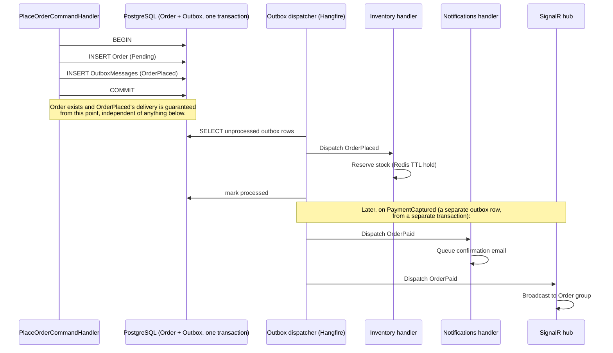

# 32 — Commerce Event Catalog

Phase 0 deliverable. Every domain event named in [30_COMMERCE_DDD_MODEL.md](30_COMMERCE_DDD_MODEL.md), frozen with its payload shape and consumers — the backend's equivalent of [19_EVENT_CATALOG.md](19_EVENT_CATALOG.md), same discipline: named and typed here first, a new event is a row added to this table, never an ad hoc `_eventBus.Publish()` call invented at the point of need.

## The outbox pattern — how events actually get delivered

A domain event raised by an aggregate inside a transaction is **not** published directly (an in-process pub/sub call inside the same transaction that raised it would either (a) run before the transaction commits, meaning a consumer could react to something that then gets rolled back, or (b) require a distributed transaction across the event bus and the database, which PostgreSQL/an in-process bus don't share). Instead:

1. The aggregate method raises the event into an in-memory list on the aggregate (`AggregateRoot.DomainEvents`).
2. On `SaveChangesAsync`, EF Core's interceptor serializes every pending domain event into an **outbox table** (`OutboxMessages`: `Id, EventType, Payload (JSONB), OccurredAt, ProcessedAt (nullable)`) in the **same transaction** as the aggregate's own state change — so the event's existence is exactly as durable as the state change that caused it, atomically, by construction.
3. A background job (Hangfire, polling every few seconds — see [35_INFRASTRUCTURE_AND_DEPLOYMENT.md](35_INFRASTRUCTURE_AND_DEPLOYMENT.md)) reads unprocessed outbox rows, dispatches them to in-process MediatR notification handlers (same-process consumers: Notifications, Analytics, Audit) and/or a message broker topic (for anything that needs to survive an app restart mid-processing), then marks them processed.

This is what makes [29_COMMERCE_ARCHITECTURE_FREEZE.md](29_COMMERCE_ARCHITECTURE_FREEZE.md)'s failure mode table honest: "a handler fails after the triggering transaction committed" is recoverable *because* the outbox row already durably exists independent of any handler succeeding — retrying means re-reading the same row, not reconstructing what should have happened from partial state.

**Implementation status, Sprint 5.1**: the `outbox_messages` table and the publish-side mechanism (`DomainEventsToOutboxInterceptor`, draining every tracked aggregate's pending events into a row in the same `SaveChangesAsync` call) are real and live — every event `User` raises this sprint lands there. The Hangfire polling dispatcher that reads and processes those rows is not yet built — correctly deferred, since a fresh Identity context has no other bounded context to notify yet (Sprint 5.1 has zero real event *consumers*). Outbox rows accumulate, unprocessed, until Sprint 5.3+ builds the dispatcher alongside its first real consumer. This is a known, deliberate gap, not an oversight — [39_COMMERCE_IMPLEMENTATION_READINESS.md](39_COMMERCE_IMPLEMENTATION_READINESS.md) tracks when the dispatcher lands.

## Event catalog

| Event | Payload | Raised by | Consumers |
|---|---|---|---|
| `UserRegistered` | `{ UserId, Email, RegisteredAtUtc }` | `User` (Identity) — **implemented, Sprint 5.1** | Notifications (welcome email), Analytics |
| `EmailVerified` | `{ UserId, VerifiedAtUtc }` | `User` — **implemented, Sprint 5.1** | Notifications, Analytics |
| `PasswordResetRequested` | `{ UserId, ResetTokenExpiresAtUtc }` | `User` — **implemented, Sprint 5.1** | Notifications (reset email — never includes the token itself in the event payload, only in the actual email, and even then as a single-use link — see [36_SECURITY_MODEL.md](36_SECURITY_MODEL.md)) |
| `PasswordChanged` | `{ UserId, ChangedAtUtc }` | `User` — **implemented, Sprint 5.1** | Notifications (security alert email), Audit |
| `UserLoggedIn` | `{ UserId, IpAddress, UserAgent, AtUtc }` | `User` (implementation note: raised from `User.RecordLogin`, not a separate application service as originally sketched — login now also sets `LastLoginAtUtc`, real aggregate state, so the aggregate raising its own event is the simpler, equally-correct path) — **implemented, Sprint 5.1** | Audit, Analytics |
| `RefreshTokenRevoked` | `{ UserId, TokenId, Reason }` | `User` — **implemented, Sprint 5.1** | Audit |
| `RefreshTokenReused` | `{ UserId, TokenId }` | `User` — **implemented, Sprint 5.1, additive** (named in docs 33/36 but not in this table's original 26 rows; added here per [37_API_STABILITY_POLICY.md](37_API_STABILITY_POLICY.md)'s extension mechanism 2 — a new row, no existing row changed) | Audit |
| `ProductCreated` / `ProductPriceChanged` / `ProductDiscontinued` | `{ ProductId, ...}` | `Product` | Catalog cache invalidation, Analytics, Audit |
| `IngredientCreated` | `{ IngredientId, Name, CompatibleCategories }` | `Ingredient` | Catalog cache invalidation |
| `CategoryCreated` | `{ CategoryId, Name }` | `Category` | Catalog cache invalidation |
| `StockDebited` / `StockReplenished` | `{ InventoryItemId, Quantity, NewBalance }` | `InventoryItem` | Analytics |
| `LowStockThresholdCrossed` | `{ InventoryItemId, CurrentBalance, Threshold }` | `InventoryItem` | Notifications (admin alert) |
| `CartItemAdded` / `CartItemRemoved` | `{ CartId, ProductId, RecipeSelection }` | `Cart` | Analytics (abandonment funnels — see [34_PAYMENTS_NOTIFICATIONS_SEARCH.md](34_PAYMENTS_NOTIFICATIONS_SEARCH.md)) |
| `OrderPlaced` | `{ OrderId, CustomerId?, Lines[], Total, PlacedAt }` | `Order` | Inventory (reserve), Analytics, Audit |
| `OrderPaid` | `{ OrderId, PaymentId, PaidAt }` | `Order` | Inventory (convert reservation to debit), Notifications (confirmation email), SignalR hub, Analytics |
| `OrderPreparing` / `OrderReady` / `OrderCompleted` | `{ OrderId, At }` | `Order` | SignalR hub, Notifications (ready-for-pickup), Engagement (unlocks review eligibility on `OrderCompleted`), Analytics |
| `OrderCancelled` | `{ OrderId, Reason, At }` | `Order` | Inventory (release reservation if not yet debited), Notifications, Analytics |
| `OrderRefunded` | `{ OrderId, PaymentId, Amount, At }` | `Order` | Notifications, Analytics, Audit |
| `CouponCreated` | `{ CouponId, Code, DiscountRule }` | `Coupon` | Audit |
| `CouponRedeemed` | `{ CouponId, OrderId, DiscountApplied }` | `Coupon` | Analytics |
| `CouponExpired` | `{ CouponId, ExpiredAt }` | Background job (scheduled sweep, not a user action) | Audit |
| `PaymentCaptured` | `{ PaymentId, OrderId, Amount, ProviderReference }` | `Payment` | Ordering (`OrderPaid` handler), Analytics, Audit |
| `PaymentFailed` | `{ PaymentId, OrderId, Reason }` | `Payment` | Analytics, Audit |
| `PaymentRefunded` | `{ PaymentId, OrderId, Amount }` | `Payment` | Ordering (`OrderRefunded` handler), Audit |
| `ReviewSubmitted` | `{ ReviewId, ProductId, UserId, Rating }` | `Review` | Analytics, Catalog (average-rating cache invalidation) |
| `FavoriteAdded` / `FavoriteRemoved` | `{ UserId, ProductId }` | `Favorite` | Analytics |
| `NotificationQueued` / `Sent` / `Failed` | `{ NotificationRequestId, Channel, TemplateKey }` | `NotificationRequest` | Audit, Analytics (delivery-rate monitoring) |
| `ContentPublished` / `ContentUnpublished` | `{ ContentBlockId, ContentType, Key }` | `ContentBlock` | Cache invalidation (Content + Catalog reads — see [29_COMMERCE_ARCHITECTURE_FREEZE.md](29_COMMERCE_ARCHITECTURE_FREEZE.md) scenario 6), Audit |

## Relationship to the frontend's existing EventBus — a real, deliberate boundary

`engine/events/EventBus.ts`'s `AppEvent` union (Sprint 0, frozen, [19_EVENT_CATALOG.md](19_EVENT_CATALOG.md)) is **synchronous, in-process, browser-only, typed coordination between frontend managers** — its own contract explicitly states this ("internal, typed, synchronous cross-manager coordination... distinct from `engine/analytics`"). The backend's domain events above are a **completely different mechanism** solving a different problem (durable, cross-context, server-side coordination), and the two are never merged into one system:

- The backend never emits directly onto the frontend's `EventBus` — there is no WebSocket bridge that turns `OrderPaid` into a literal `appEvents.emit()` call in the browser.
- Where a backend event needs to become a *frontend-visible* signal, it does so through an existing, ordinary channel: SignalR pushes a typed message the frontend's own code reacts to by calling **its own** `appEvents.emit()` if and when that's the right frontend-side mechanism (e.g. an order-status SignalR message could cause `features/cart/`'s own code to emit a `cart:updated`-shaped signal locally) — the translation happens in frontend code, deliberately, not by widening the backend's event shape to match the frontend's naming convention or vice versa.
- **No shared type file, no shared event name, ever.** `OrderPlaced` (backend, PascalCase, C#) and `cart:item-added` (frontend, colon-namespaced, TypeScript) are allowed to describe conceptually related occurrences without being the same contract — coupling their literal shapes would violate both [17_ZERO_REWRITE_POLICY.md](17_ZERO_REWRITE_POLICY.md) (frontend event payloads are frozen, unrelated to whatever the backend does) and this document's own frozen catalog (backend event payloads are frozen independently).

This boundary is itself a Zero Rewrite Policy application: the frontend's EventBus is a shipped, frozen system exactly like `CameraRig` — Milestone 5 extends the *system as a whole* by composing a new mechanism alongside it, never by reaching in and modifying `AppEvent`'s meaning to accommodate backend concerns.

## Order placement, worked example — outbox in practice

## Related

[milestone-5-commerce-rfc.md](milestone-5-commerce-rfc.md) · [29_COMMERCE_ARCHITECTURE_FREEZE.md](29_COMMERCE_ARCHITECTURE_FREEZE.md) · [30_COMMERCE_DDD_MODEL.md](30_COMMERCE_DDD_MODEL.md) · [19_EVENT_CATALOG.md](19_EVENT_CATALOG.md) · [35_INFRASTRUCTURE_AND_DEPLOYMENT.md](35_INFRASTRUCTURE_AND_DEPLOYMENT.md)
