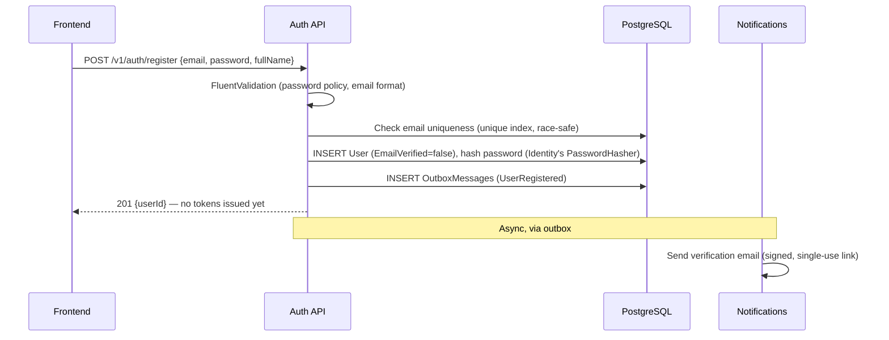
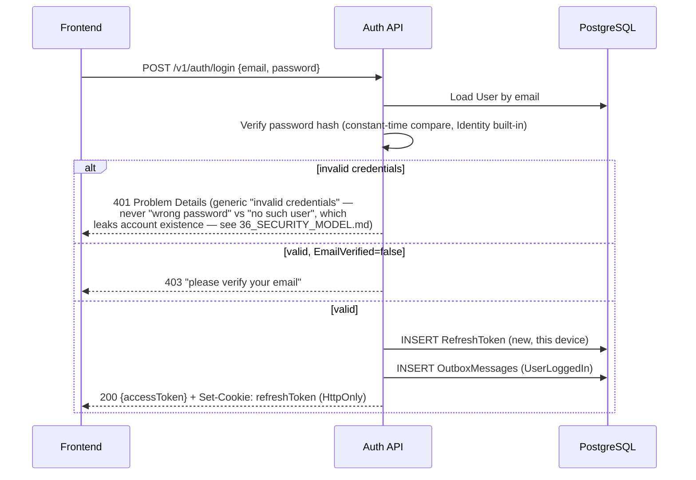
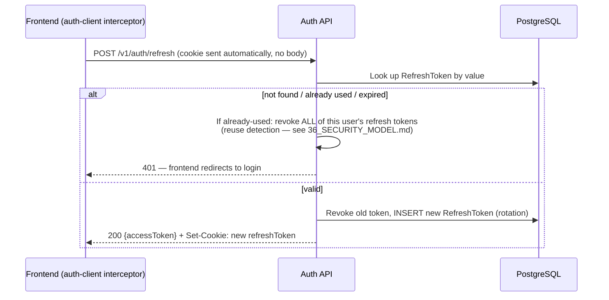
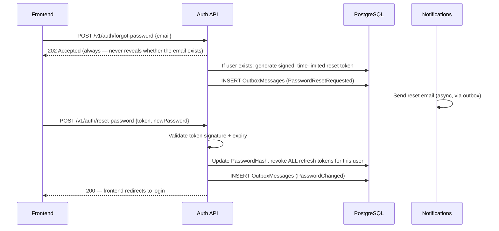

# 33 — Authentication Architecture

Phase 0 deliverable. Full design for real authentication — ASP.NET Core Identity + JWT access tokens + rotating refresh tokens + role/policy-based authorization — frozen before Sprint 5.1 begins.

## Implementation status — Sprint 5.1 (shipped)

Built as designed below, with two real, reasoned deviations found during implementation (full detail in [docs/reviews/sprint-5.1-review.md](reviews/sprint-5.1-review.md)):

1. **No separate "Session" entity.** `RefreshToken` alone carries every field a "session" would need (`DeviceName`, `UserAgent`, `CreatedAtUtc`, `LastUsedAtUtc`) — exactly what this document's "Each `RefreshToken` **is** a session" line already specified. A later brief's Phase 2 also asked for a distinct "Session entity"; resolved in favor of this already-frozen design rather than introducing a second, competing concept.
2. **Reuse-detection is scoped to rotation, not any revocation.** The frozen design said a revoked token presented again triggers a full revoke-all. Implementation revealed this needs narrowing: a token revoked by *rotation* (`ReplacedByTokenId` set — the real theft/reuse signal) triggers revoke-all, per this document's own intent; a token revoked for any other reason (logout, `/revoke-session`, password reset) presented again is just a stale cookie — an ordinary invalid-token failure, not cascaded into revoking every other session. The original design under-specified this distinction; a real bug during manual verification (revoking one session and then refreshing with its cookie killed every other session too) is what surfaced it.

Every endpoint below is live and covered by both an integration test suite (`backend/tests/Coffeshop.IntegrationTests`) and Playwright e2e tests (`e2e/auth.spec.ts`) exercising the real API, not a mock.

## Token strategy

| Token | Lifetime | Storage (frontend) | Contains |
|---|---|---|---|
| Access token (JWT) | 15 minutes | In memory only (a module-level variable in a new `lib/auth-client.ts`, never `localStorage`/`sessionStorage` — an XSS payload that can read `localStorage` can exfiltrate a long-lived credential; an in-memory token is gone on tab close/refresh, which the refresh flow below handles transparently) | `sub` (UserId), `email`, `roles[]`, `permissions[]` (flattened at issuance so authorization checks never need a database round trip per request — see [36_SECURITY_MODEL.md](36_SECURITY_MODEL.md)'s note on why this is safe despite roles being able to change), `exp`, `iss`, `aud` |
| Refresh token | 30 days, **rotating** (single-use — redeeming one immediately revokes it and issues a new one) | `HttpOnly`, `Secure`, `SameSite=Strict` cookie — never readable by JavaScript at all, closing the XSS-exfiltration path entirely for the long-lived credential | An opaque random value (not a JWT — no reason to make it parseable, it's only ever looked up by value against the `RefreshToken` entity) |

**Why rotation, not a static refresh token**: a static long-lived refresh token that's ever stolen (a compromised device, a logged network) remains valid until its natural 30-day expiry with no way to detect the theft. Rotation means a stolen-then-used token immediately invalidates the legitimate holder's copy too — the next legitimate refresh attempt fails, which is a detectable signal (logged as a security event, see [36_SECURITY_MODEL.md](36_SECURITY_MODEL.md)) that something is wrong, not a silent, undetectable compromise.

## Sequence diagrams

### Register

### Login

### Silent refresh (on 401 from any authenticated request, or on app load)

### Forgot / reset password

## Roles & permissions

Role-based *and* policy-based, not one or the other — roles are coarse (`Customer`, `Staff`, `Admin`), permissions are fine-grained (`Permission.ManageProducts`, `Permission.ViewAnalytics`, `Permission.ManageContent`, `Permission.ProcessRefunds`) and a `RoleDefinition` is just a named bundle of permissions, per [30_COMMERCE_DDD_MODEL.md](30_COMMERCE_DDD_MODEL.md). Authorization checks in code always check a **permission**, never a role name directly (`[Authorize(Policy = "CanManageProducts")]`, never `[Authorize(Roles = "Admin")]`) — this is what lets a future `Staff` role gain `ManageProducts` without touching a single controller attribute, the backend's own version of the frontend's registry-extension discipline.

| Role (seeded) | Permissions |
|---|---|
| `Customer` | None beyond the implicit "manage my own account/orders/reviews/favorites" (enforced by resource ownership checks, not a permission list — see below) |
| `Staff` | `ViewOrders`, `UpdateOrderStatus`, `ViewInventory`, `AdjustInventory` |
| `Admin` | Every permission, including `ManageUsers`, `ManageRoles`, `ManageContent`, `ManageProducts`, `ViewAnalytics`, `ProcessRefunds`, `ViewAuditLogs` |

**Resource ownership, a distinct concern from permissions**: a `Customer` viewing `GET /v1/orders/{id}` is authorized not by a permission but by a resource-ownership check (`order.CustomerId == currentUserId`) — implemented as an ASP.NET Core `IAuthorizationHandler` per resource type, never duplicated as an `if` check inside every handler that touches an owned resource.

## OAuth-ready architecture

Not implemented in Sprint 5.1 (no named requirement for a specific provider yet — building it speculatively would violate the same anti-speculation rule [17_ZERO_REWRITE_POLICY.md](17_ZERO_REWRITE_POLICY.md) already applies to the frontend), but the `User` aggregate's persistence model reserves the shape: a separate `ExternalLogin` entity (`UserId, Provider, ProviderKey`) that ASP.NET Core Identity's own `UserManager.AddLoginAsync` already models natively — adding Google/GitHub/etc. sign-in later is wiring a new `AddAuthentication().AddGoogle(...)` call plus one new endpoint, never a `User` schema migration or a change to the JWT-issuance code path (an external login still ends in the same "issue a JWT + refresh token pair" step every other login path uses).

## Session management & multi-device

Each `RefreshToken` **is** a session, one per device/browser — there is no separate "session" concept beyond that, deliberately, per [30_COMMERCE_DDD_MODEL.md](30_COMMERCE_DDD_MODEL.md)'s `User` aggregate. `GET /v1/auth/sessions` lists a user's active `RefreshToken`s (device/IP/last-used metadata, never the token value itself); `DELETE /v1/auth/sessions/{id}` revokes one; `POST /v1/auth/sessions/revoke-all` revokes every token except the caller's own current one (the "log out everywhere else" pattern real products ship).

## Security events (feeding Audit + rate limiting, detail in 36_SECURITY_MODEL.md)

`UserLoggedIn`, `RefreshTokenReused` (the reuse-detection trigger above), `PasswordChanged`, repeated failed login attempts (rate-limited and logged, not just rate-limited silently) — every one of these is a real `AuditLogEntry`, queryable by an admin, not just a Serilog line lost in aggregate log volume.

## Frontend integration — additive, per the RFC's own rule (implemented, Sprint 5.1)

`src/lib/auth-client.ts` (in-memory access token + a `fetch`-based silent-refresh flow, one shared in-flight refresh promise so a burst of near-simultaneous 401s can't race multiple rotations against the same single-use refresh cookie) and `src/stores/auth-store.ts` (the current user, if any — `null`/`"anonymous"` is the default and fully-supported state, not an error state). New routes only: `/login`, `/register`, `/verify-email`, `/forgot-password`, `/reset-password`, plus an additive `AccountMenu` slot in the existing `Navbar` (no existing nav item touched). `cart-store.ts` was not touched this sprint — its `placeOrder()`/`guestContact` integration is real Sprint 5.3 (Ordering Platform) scope, since no `Order` aggregate exists yet; flagged here so this line isn't mistaken for already-done.

## Related

[milestone-5-commerce-rfc.md](milestone-5-commerce-rfc.md) · [30_COMMERCE_DDD_MODEL.md](30_COMMERCE_DDD_MODEL.md) · [36_SECURITY_MODEL.md](36_SECURITY_MODEL.md) · [31_COMMERCE_ENGINEERING_CONTRACTS.md](31_COMMERCE_ENGINEERING_CONTRACTS.md)
