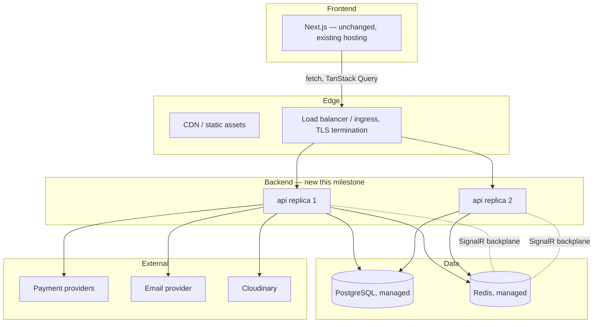

# 35 — Infrastructure & Deployment

Phase 0 deliverable. Everything needed to run the backend from a laptop to production, frozen before Sprint 5.1 begins. Nothing here is aspirational — every piece named is used by at least one concrete flow already specified in docs 29-34.

## Docker topology

**Development** (`docker-compose.yml`, run alongside `next dev` — the frontend never runs in a container in dev, hot reload matters more than parity there):

| Service | Image | Purpose |
|---|---|---|
| `api` | Built from `Dockerfile.dev` (SDK image, `dotnet watch`) | The ASP.NET Core app itself |
| `postgres` | `postgres:16-alpine` | Primary datastore |
| `redis` | `redis:7-alpine` | Cache, rate-limiting counters, inventory reservations, SignalR backplane (see below) |
| `mailhog` | `mailhog/mailhog` | Local `IEmailProvider` sink — every dev email is caught and viewable at `localhost:8025`, never actually sent |
| `seq` | `datalust/seq` | Local Serilog sink with a real query UI — chosen over reading raw console JSON during dev |

**Production** (`docker-compose.prod.yml` / equivalent cloud-native manifests — the compose file is the source of truth for service topology, translated to the target platform's actual primitives at deploy time, never diverging from it):

| Service | Notes |
|---|---|
| `api` | `Dockerfile` multi-stage build (SDK → runtime-only final image, no SDK/source in the shipped image); horizontally scalable, stateless (session state lives in JWT + Redis, never in-process — this is what makes horizontal scaling safe at all) |
| `postgres` | Managed (RDS/Azure Database for PostgreSQL/Supabase-class service) — never a self-hosted container in production, backups/failover are not something to reinvent |
| `redis` | Managed (ElastiCache/Azure Cache for Redis-class service), same reasoning |
| Reverse proxy / ingress | TLS termination, the one place `/api/v1/` vs a future `/api/v2/` routing could also be observed at the infra layer, though the app itself is what actually enforces the contract (see [37_API_STABILITY_POLICY.md](37_API_STABILITY_POLICY.md)) |

## Redis cache strategy

One Redis instance, five distinct usages — kept distinct by key prefix (`cache:`, `ratelimit:`, `reserve:`, `session:`, `search:`) so a future decision to split them onto separate instances is a config change, not a redesign:

| Prefix | Used for | TTL |
|---|---|---|
| `cache:catalog:*` | Read-through cache for `Product`/`Category`/`Ingredient` reads and CMS `ContentBlock` reads (the fix from [29_COMMERCE_ARCHITECTURE_FREEZE.md](29_COMMERCE_ARCHITECTURE_FREEZE.md) scenario 6) | 5 minutes, plus explicit invalidation on the relevant domain event (`ProductPriceChanged`, `ContentPublished`, etc.) — TTL is a safety net, not the primary invalidation mechanism |
| `ratelimit:*` | Sliding-window counters backing the rate-limiting middleware ([36_SECURITY_MODEL.md](36_SECURITY_MODEL.md)) | Matches the window (e.g. 1 minute) |
| `reserve:*` | `IInventoryReservation` TTL holds ([34_PAYMENTS_NOTIFICATIONS_SEARCH.md](34_PAYMENTS_NOTIFICATIONS_SEARCH.md)) | 10 minutes |
| `search:autocomplete:*` | The autocomplete sorted set | Rebuilt on write, no TTL |
| `session:*` | Not user sessions (those are the `RefreshToken` table, per [33_AUTH_ARCHITECTURE.md](33_AUTH_ARCHITECTURE.md)) — reserved for SignalR's own connection-group bookkeeping | Connection-lifetime |

**SignalR backplane**: the same Redis instance doubles as SignalR's scale-out backplane (`AddStackExchangeRedis`) — required the moment `api` runs as more than one replica, since a client's WebSocket connection lands on one specific instance but an `OrderReady` broadcast can be triggered by a Hangfire job running on any instance. Provisioned from Sprint 5.1 even though a single replica doesn't strictly need it yet, because retrofitting a backplane after real multi-instance traffic exists is strictly harder than provisioning it up front — the one piece of this doc that is intentionally ahead of Milestone 5's own launch-day scale, justified narrowly for this reason alone.

## Background jobs (Hangfire)

| Job | Trigger | Does |
|---|---|---|
| Outbox dispatcher | Recurring, every 5 seconds | Reads unprocessed `OutboxMessages` rows, dispatches to MediatR notification handlers, marks processed — see [32_COMMERCE_EVENT_CATALOG.md](32_COMMERCE_EVENT_CATALOG.md) |
| Reservation sweep | Recurring, every minute | Best-effort cleanup of any Redis reservation whose TTL somehow didn't fire its release (belt-and-suspenders, not the primary release mechanism — TTL expiry itself is) |
| Coupon expiry sweep | Recurring, daily | Raises `CouponExpired` for coupons past `ExpiresAt` still marked active |
| Low-stock check | Recurring, hourly | Re-derives `LowStockThresholdCrossed` for anything that crossed the line without a triggering `StockDebited` in between checks (a safety re-check, not the primary trigger) |
| Invoice PDF render | On-demand, not scheduled | Per [34_PAYMENTS_NOTIFICATIONS_SEARCH.md](34_PAYMENTS_NOTIFICATIONS_SEARCH.md), triggered by the `GET /v1/orders/{id}/invoice` request itself, not pre-generated |

Hangfire's own dashboard (`/hangfire`) is mounted behind the `ManageUsers`-tier admin policy — never publicly reachable, consistent with [36_SECURITY_MODEL.md](36_SECURITY_MODEL.md)'s admin-surface rules.

## Observability

| Concern | Tool | Notes |
|---|---|---|
| Structured logging | Serilog, JSON sink | Every log line carries a correlation id (the `TraceId` below) — a support request referencing one failed order can be traced through every service that touched it |
| Distributed tracing | OpenTelemetry (`Activity`/`ActivitySource`), OTLP exporter | Spans cross MediatR handler boundaries and outbound HTTP (payment provider calls, email provider calls) — the concrete payoff: scenario 4's payment-provider-timeout failure mode ([29_COMMERCE_ARCHITECTURE_FREEZE.md](29_COMMERCE_ARCHITECTURE_FREEZE.md)) is diagnosable from a trace, not guessed at from logs alone |
| Metrics | OpenTelemetry Metrics, same OTLP pipeline | Request rate/latency/error-rate per endpoint, Hangfire job duration/failure counts, outbox queue depth (a growing queue depth is the single earliest signal something downstream is broken) |
| Health checks | ASP.NET Core `HealthChecks` middleware | `/health/live` (process is up, no dependency checks — what a container orchestrator's liveness probe hits) and `/health/ready` (DB + Redis reachable — what a load balancer's readiness probe hits, and what gates a rolling deploy from routing traffic to a new instance) |

## Environments & secrets

| Environment | Config source | Notes |
|---|---|---|
| Local dev | `appsettings.Development.json` + `docker-compose.yml` env vars, `dotnet user-secrets` for anything sensitive even locally (never a real secret committed to a `.json` file, dev or not) | Mailhog/Seq/local Postgres — no real payment provider or email provider credentials ever needed locally (Stripe/Paymob's own test-mode keys, which are safe to hold in `user-secrets`) |
| CI | GitHub Actions secrets | Ephemeral Postgres/Redis service containers per run, never a shared/persistent CI database |
| Staging / Production | Cloud provider's secret manager (AWS Secrets Manager / Azure Key Vault-class service), injected as environment variables at container start | No secret ever lives in an image layer or a compose file checked into the repo |

Config precedence follows ASP.NET Core's own standard layering (`appsettings.json` → `appsettings.{Environment}.json` → env vars → secret manager), never a custom scheme.

## CI/CD readiness

Pipeline shape frozen now, wired for real in Sprint 5.6 ([39_COMMERCE_IMPLEMENTATION_READINESS.md](39_COMMERCE_IMPLEMENTATION_READINESS.md) covers the per-sprint detail): `build → unit tests → integration tests (against ephemeral Postgres/Redis containers) → Docker image build → push to registry → deploy`. Migrations run as an explicit pre-deploy step (`dotnet ef database update` against the target environment), never `EnsureCreated()`/auto-migrate-on-app-start in any environment beyond local dev — a failed migration must halt the deploy before traffic shifts, not surface as a 500 after it (this is the migration-failure row already named in [29_COMMERCE_ARCHITECTURE_FREEZE.md](29_COMMERCE_ARCHITECTURE_FREEZE.md)'s failure-modes table).

## Cloud topology

The frontend's own hosting/CDN is unaffected by any of this — it gains a new environment variable (`NEXT_PUBLIC_API_BASE_URL`) and nothing else, per the RFC's integration-strategy section.

## Related

[milestone-5-commerce-rfc.md](milestone-5-commerce-rfc.md) · [29_COMMERCE_ARCHITECTURE_FREEZE.md](29_COMMERCE_ARCHITECTURE_FREEZE.md) · [32_COMMERCE_EVENT_CATALOG.md](32_COMMERCE_EVENT_CATALOG.md) · [36_SECURITY_MODEL.md](36_SECURITY_MODEL.md) · [39_COMMERCE_IMPLEMENTATION_READINESS.md](39_COMMERCE_IMPLEMENTATION_READINESS.md)
