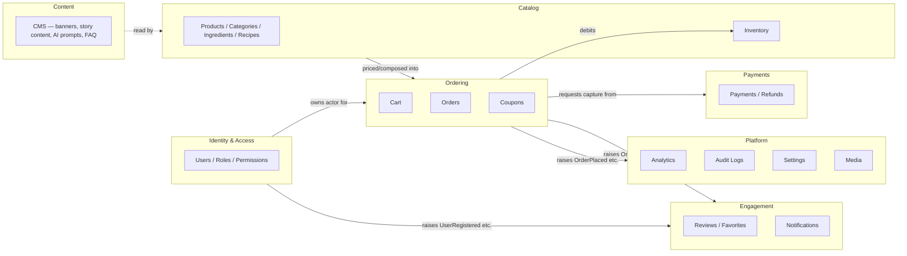

# Milestone 5 — Real Commerce Platform: RFC

**Status**: Design in progress, pending approval. **No implementation has started** — this document and the ones it links to are the entire deliverable of Phase 0 (Commerce Architecture Freeze). Verified via `git status` at the end of this phase, the same discipline [milestone-2-architecture-rfc.md](milestone-2-architecture-rfc.md) established for the engine and every design-only phase since.

**Purpose**: design a real, production-grade backend — ASP.NET Core 10, Clean Architecture, DDD, CQRS, PostgreSQL — so that everything currently mocked or session-based in the Next.js frontend becomes real, without rewriting a single existing manager, store, or component. This doc is the critique (what's mocked today, and why it matters) plus an index into the detailed design docs this phase produces.

## The central thesis

Milestones 1–4 proved the frontend can be built entirely from registries, contracts, and composition, with the rendering engine frozen since Sprint 2.6. Milestone 5 applies the exact same discipline to a system that doesn't exist yet: **the backend is designed contract-first, exactly like the engine was**, and the frontend's own Zero Rewrite Policy gets a backend-facing sibling — connecting an existing store to a real API is an *adapter swap*, not a rewrite of the store, the same way registering a real GLB part was never a rewrite of `CupAssembly`.

Concretely: `stores/cart-store.ts`, `customizer-store.ts`, `concierge-store.ts`, `ai-barista-store.ts`, `onboarding-store.ts` — every Zustand store this project has shipped — keeps its exact same shape (selectors, actions, the values components already read). What changes is *what's behind* a small number of actions: `placeOrder()` currently mutates local state and clears `localStorage`; after Milestone 5, it calls a real `POST /api/v1/orders` and the store's action body becomes a thin API call, its signature and every caller unchanged. This is the same "additive extension, never a rewrite" test [17_ZERO_REWRITE_POLICY.md](17_ZERO_REWRITE_POLICY.md) already applies to the engine, applied here to the frontend-backend seam.

## What's mocked today, concretely — the actual gap this milestone closes

| Today | Real backend equivalent | Frontend surface that stays unchanged |
|---|---|---|
| `features/menu/data/drinks.ts` — a static, hardcoded array, 14 drinks | `GET /api/v1/products` — PostgreSQL-backed, paginated, filterable, searchable | `features/menu/`'s components; `resolveDrink()` becomes a thin query hook with the same return shape |
| `features/composer/data/ingredients.ts` — static array | `GET /api/v1/ingredients` | Same — `resolveIngredient()`/`isIngredientCompatible()` keep their signatures |
| `stores/customizer-store.ts` — `sessionStorage`, presets never leave the browser | Presets persist server-side once a user is authenticated; anonymous sessions keep today's `sessionStorage` behavior unchanged (see [API Stability Policy](37_API_STABILITY_POLICY.md) — a real capability added, nothing removed) | Every existing selector/action name and shape |
| `stores/cart-store.ts` — `localStorage`, `placeOrder()` synthesizes a fake `CompletedOrder` locally | Real cart/order APIs, real payment capture, real order lifecycle | `RecipeSnapshot`, `CartItem`, `CompletedOrder` types are the literal DTO shapes the backend targets — see [Engineering Contracts](31_COMMERCE_ENGINEERING_CONTRACTS.md) |
| `stores/concierge-store.ts` — pure client-side scoring function | Unchanged. `generateRecommendation` stays a pure, local, deterministic function — **not** moved server-side; see "What deliberately does not move server-side" below | No change at all |
| `features/ai-barista/` — `POST /api/ai-barista/chat` proxies to a local Ollama instance, no persistence, no auth | The same route, extended: conversation history persists per authenticated user; anonymous chat keeps working exactly as today | `useAiBaristaChat.ts`'s public shape unchanged |
| No authentication anywhere — every store is anonymous, per-browser | Real Identity: register/login/JWT/refresh/roles/permissions | A new, additive `useAuth()`/`useSession()` surface — nothing existing requires auth to keep working (see Guest Checkout in [30_COMMERCE_DDD_MODEL.md](30_COMMERCE_DDD_MODEL.md)) |
| No admin surface | A real CMS/admin dashboard — a **new** Next.js route group (`/admin`), not a rewrite of the storefront | Zero change to any existing route |

**What deliberately does not move server-side**: `features/concierge/lib/recommendationEngine.ts` stays exactly where it is, exactly as documented in its own doc comment ("a deterministic, fully explainable scoring pass... not an LLM call... this project has no backend" — that comment is now half-true, and the half that changes is "has no backend," not "the engine runs client-side"). Moving deterministic, instant, zero-privacy-sensitivity scoring logic to a network round trip would be a real regression (latency, a new failure mode) for zero real benefit — the same "don't add a capability nothing asked for" discipline [17_ZERO_REWRITE_POLICY.md](17_ZERO_REWRITE_POLICY.md)'s Architectural Maturity Rule already states. The *product catalog it scores against* becomes real and server-fetched (`GET /api/v1/products`); the *scoring* stays a pure client function over whatever catalog it's given, which is precisely how it's written today (`generateRecommendation(profile, drinks, options)` — `drinks` is already a parameter, not an import of the static array, at every call site that matters).

## Tech stack, and why

| Layer | Choice | Why (not a default — a decision) |
|---|---|---|
| API framework | ASP.NET Core 10, Clean Architecture (Domain / Application / Infrastructure / Presentation) | Enforces the DDD boundary at the project-reference level, not just convention — a Domain project that cannot `using` Infrastructure is a compile error, not a code-review nit. See [ADR-0010](adr/0010-backend-clean-architecture-ddd-cqrs.md). |
| Domain modeling | DDD — aggregates, entities, value objects, domain events | The domain (Orders, Payments, Inventory) has real invariants (an `Order` cannot transition `Completed → Pending`; a `Coupon` cannot apply below its minimum spend) that a plain CRUD/anemic-model API would push into controllers, duplicated per endpoint. DDD keeps invariants in exactly one place — the aggregate root. |
| Read/write split | CQRS via MediatR, same read/write database initially | Full event-sourced CQRS (separate read/write stores) is not justified by this project's real scale — see [ADR-0010](adr/0010-backend-clean-architecture-ddd-cqrs.md)'s honest scoping. What *is* adopted now: commands and queries are separate MediatR request types with separate handlers, so a future read-model split (e.g. a materialized "product search" projection in Redis) is an additive handler swap, not an architectural rewrite. |
| Validation | FluentValidation, one validator per command/query, run as a MediatR pipeline behavior | Keeps validation out of controllers and out of domain entities (which validate *invariants*, not *input shape* — a real, worthwhile distinction, see [30_COMMERCE_DDD_MODEL.md](30_COMMERCE_DDD_MODEL.md)). |
| ORM | Entity Framework Core, Code-First, PostgreSQL | EF Core's `IEntityTypeConfiguration<T>` keeps mapping concerns out of domain classes (a domain `Order` has zero EF attributes); PostgreSQL for real relational integrity, JSONB columns where a value object's shape doesn't earn its own table (see [30_COMMERCE_DDD_MODEL.md](30_COMMERCE_DDD_MODEL.md)'s per-aggregate persistence notes), and because it's genuinely free/open-source at any scale this project will reach. |
| Cache | Redis | Catalog reads, search results, session/rate-limit counters, analytics rollups — see [35_INFRASTRUCTURE_AND_DEPLOYMENT.md](35_INFRASTRUCTURE_AND_DEPLOYMENT.md). |
| Real-time | SignalR | Order-status pushes to the storefront and the (future) admin dashboard — an order moving `Preparing → Ready` should be visible without a poll. Additive: the frontend's own order-history UI degrades to polling if a SignalR connection can't be established, never a hard dependency. |
| Auth | ASP.NET Core Identity + JWT access tokens + rotating refresh tokens | Industry-standard, avoids hand-rolling password hashing/token issuance; see [33_AUTH_ARCHITECTURE.md](33_AUTH_ARCHITECTURE.md). |
| Observability | OpenTelemetry (traces/metrics) + Serilog (structured logs) | Vendor-neutral instrumentation — the actual backend (Grafana, Honeycomb, whatever) is chosen at deployment time, never baked into application code, mirroring this project's own `IAnalyticsManager` sink-swap philosophy on the frontend. |
| Background jobs | Hangfire | Email sending, analytics aggregation, scheduled promotions, inventory sync — a real persistent job store (PostgreSQL-backed, not in-memory), survives a restart. |
| Media | Cloudinary, behind an abstraction | Product/ingredient images, never bound to one provider in application code — see [34_PAYMENTS_NOTIFICATIONS_SEARCH.md](34_PAYMENTS_NOTIFICATIONS_SEARCH.md)'s abstraction pattern, applied identically to Payment/Email/Blob Storage. |
| Containerization | Docker + Docker Compose (dev), a documented production profile | See [35_INFRASTRUCTURE_AND_DEPLOYMENT.md](35_INFRASTRUCTURE_AND_DEPLOYMENT.md). |
| Frontend | **Unchanged.** Next.js 16, the existing App Router, the existing `engine/`/`design-system/`/`features/` split | Zero Rewrite Policy applies here at full force — see "Frontend integration strategy" below. |

## Bounded contexts — the map, detail in 30_COMMERCE_DDD_MODEL.md

Each bounded context is a single ASP.NET Core solution's set of projects sharing one deployable (a modular monolith, not microservices — see [ADR-0010](adr/0010-backend-clean-architecture-ddd-cqrs.md)'s explicit reasoning against microservices at this scale) but with **enforced internal boundaries**: a context depends on another only through its public application-layer contracts (a command, a query, a domain event) — never by reaching into another context's `DbContext`, entities, or repositories directly. This is the backend's own version of "features depend on engine, never the reverse."

## Frontend integration strategy — the Zero Rewrite Policy applied to this seam

1. **Every existing store keeps its exact public shape.** A store's actions that currently mutate local state gain a real network call *inside* the action body. No selector, no action name, no return type changes. Verified per-store in [31_COMMERCE_ENGINEERING_CONTRACTS.md](31_COMMERCE_ENGINEERING_CONTRACTS.md) against the actual shipped store files, not a re-derivation.
2. **TanStack Query, wired since Milestone 1 and correctly unused until now** (`ADR-0005`, reaffirmed every milestone since — `features/concierge/`'s own recommendation engine explicitly declined to use it because no real endpoint existed), is this milestone's real, first consumer. `GET /api/v1/products` and every other read endpoint is a `useQuery`; every write is a `useMutation` wrapped by the existing store's action. This is not a new decision — it's Milestone 1's own plumbing finally being used for what it was built for.
3. **Anonymous-first, auth-additive.** Every existing flow (browse, customize, add to cart, even checkout) continues working without an account — real production commerce sites support guest checkout, and this project's own frontend was never designed assuming a logged-in user. Authentication *adds* capabilities (order history, saved presets, favorites persistence) without ever *gating* what already works.
4. **No route is rewritten; new routes are added.** `/admin/*` is a new route group. Existing routes (`/`, `/menu`, `/customize`, `/concierge`, `/cart`, `/checkout`, `/story`) keep their exact URLs and components; only their data sources change from static/local to real, behind the same hooks.
5. **The AI Barista's existing Ollama integration is untouched.** `POST /api/ai-barista/chat` (a Next.js Route Handler, Sprint 3.9) continues proxying to Ollama exactly as today. What's additive: if a request carries a valid session, the conversation is persisted (a new `ConversationHistory` read/write against the new backend) — anonymous requests behave exactly as they do today, zero regression.

## Stress-test methodology for Phase 0

Mirrors [15_ARCHITECTURE_FREEZE.md](15_ARCHITECTURE_FREEZE.md)'s own method exactly: concrete future scenarios run through the design on paper before any code exists, a dependency graph checked for cycles, failure modes analyzed for detection/recovery, and every aggregate boundary tested against "does this operation need to span two aggregates in one transaction" (a real DDD smell if yes, almost always resolvable via eventual consistency + a domain event instead). Full pass: [29_COMMERCE_ARCHITECTURE_FREEZE.md](29_COMMERCE_ARCHITECTURE_FREEZE.md).

## Detailed design docs (this phase's full deliverable)

- **[29_COMMERCE_ARCHITECTURE_FREEZE.md](29_COMMERCE_ARCHITECTURE_FREEZE.md)** — the adversarial stress-test: 12 scenarios, dependency graph, failure modes, extensibility review.
- **[30_COMMERCE_DDD_MODEL.md](30_COMMERCE_DDD_MODEL.md)** — bounded contexts, aggregates, entities, value objects, invariants, domain events, per module.
- **[31_COMMERCE_ENGINEERING_CONTRACTS.md](31_COMMERCE_ENGINEERING_CONTRACTS.md)** — repository contracts, CQRS command/query shapes, REST conventions, representative endpoint catalog.
- **[32_COMMERCE_EVENT_CATALOG.md](32_COMMERCE_EVENT_CATALOG.md)** — domain/integration events, the outbox pattern, the relationship to the frontend's own (separate, unchanged) EventBus.
- **[33_AUTH_ARCHITECTURE.md](33_AUTH_ARCHITECTURE.md)** — Identity, JWT/refresh, roles/permissions, sequence diagrams for register/login/refresh/reset.
- **[34_PAYMENTS_NOTIFICATIONS_SEARCH.md](34_PAYMENTS_NOTIFICATIONS_SEARCH.md)** — payment provider abstraction, coupon rules, order lifecycle, inventory strategy, search architecture, notification/email architecture.
- **[35_INFRASTRUCTURE_AND_DEPLOYMENT.md](35_INFRASTRUCTURE_AND_DEPLOYMENT.md)** — Docker topology, Redis, background jobs, telemetry, CI/CD, cloud topology.
- **[36_SECURITY_MODEL.md](36_SECURITY_MODEL.md)** — threat model, authn/authz, rate limiting, secrets, data protection.
- **[37_API_STABILITY_POLICY.md](37_API_STABILITY_POLICY.md)** — the new companion policy to [17_ZERO_REWRITE_POLICY.md](17_ZERO_REWRITE_POLICY.md), governing API/DTO/contract stability from this milestone forward.
- **[38_COMMERCE_RISK_REGISTER.md](38_COMMERCE_RISK_REGISTER.md)** / **[39_COMMERCE_IMPLEMENTATION_READINESS.md](39_COMMERCE_IMPLEMENTATION_READINESS.md)** — risk register and per-sprint readiness (prerequisites, exit criteria, rollback).
- **[adr/0010](adr/0010-backend-clean-architecture-ddd-cqrs.md) through [adr/0015](adr/0015-frontend-backend-integration-strategy.md)** — the biggest individually-reversible-cost decisions this design makes.
- **[40_COMMERCE_RC0_APPROVAL.md](40_COMMERCE_RC0_APPROVAL.md)** — final consistency audit, engineering scorecard, go/no-go declaration. Sprint 5.1 may not begin until this is approved.

## Sprint roadmap (sketch — full detail in 39_COMMERCE_IMPLEMENTATION_READINESS.md)

| Sprint | Scope |
|---|---|
| 5.0 | This phase — Commerce Architecture Freeze. Documentation only. |
| 5.1 | Authentication Platform — Identity, JWT/refresh, roles, permissions, email verification, password reset |
| 5.2 | Product Platform — Products, Categories, Ingredients, Recipes, Media, Search, Inventory |
| 5.3 | Ordering Platform — Cart API, Checkout, Orders, Invoices, Coupons, Payments abstraction |
| 5.4 | Administration Platform — CMS, Dashboard, Analytics, Audit Logs, Settings, User Management |
| 5.5 | Infrastructure Platform — Redis, Docker, Telemetry, Logging, Background Jobs, Cloud, Deployment, CI/CD |
| 5.6 | Production Readiness — Security Audit, Load Testing, Performance, Accessibility, API Review, Documentation, Regression, Release Candidate |

## Related

[00_SYSTEM_PROMPT.md](00_SYSTEM_PROMPT.md) · [01_ARCHITECTURE.md](01_ARCHITECTURE.md) · [08_MILESTONES.md](08_MILESTONES.md) · [17_ZERO_REWRITE_POLICY.md](17_ZERO_REWRITE_POLICY.md) · [RC1_RELEASE_CANDIDATE_REPORT.md](RC1_RELEASE_CANDIDATE_REPORT.md)
