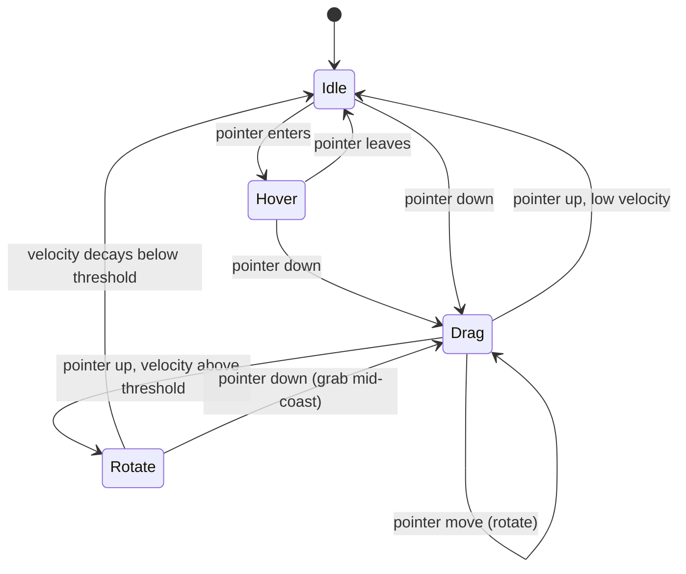

# Hero Cup — Interaction State Machine

Implemented in `features/hero-cup/hooks/useCupInteractionState.ts`. Four states, not the five in early drafts of this doc — "Release" turned out to be a transition, not a state worth its own name (it's the instant decision point between `Drag` and `Idle`/`Rotate`, not something anything ever reads as a distinct mode).

## What each state drives

| State | Idle auto-spin | Rotation source | Notes |
|---|---|---|---|
| `idle` | On (unless reduced motion) | Ambient spin, `IDLE_ROTATION_SPEED` | Idle float (`CupAssembly`'s own `useFrame`) also runs here |
| `hover` | Off | None (frozen) | Deliberate: pausing auto-spin on hover is the "I'm ready for you" cue |
| `drag` | Off | 1:1 with pointer `clientX` delta (`DRAG_SENSITIVITY`) | Tracked via `window` listeners, not element-bound, so the drag continues even if the pointer leaves the canvas |
| `rotate` | Off | Exponential velocity decay (`INERTIA_DAMPING`) each frame until `INERTIA_STOP_THRESHOLD` | Skipped entirely under reduced motion — `disableInertia` makes every release land straight on `idle` |

`rotationYRef` is the single accumulator every state writes into — idle auto-spin, drag, and inertia all add to the same value, so a user's drag persists smoothly into the next state rather than resetting.

## Keyboard rotation (not a state)

Drag has no keyboard equivalent by default, which would leave keyboard-only users able to see the cup (idle auto-spin still plays) but never steer it. Focusing the canvas (`tabIndex`, `role="application"` on `CupCanvas`) and pressing Left/Right nudges `rotationYRef` directly, independent of the state above — it isn't modeled as its own state because it's a discrete nudge, not an ongoing mode. The DOM keydown source (outside the R3F tree) and `rotationYRef` (inside it) are bridged by a tiny "write here, drain each frame" store — see `hooks/useCupKeyboardControls.ts`.

## Reduced motion

- Idle auto-spin: off.
- Idle float (position bob): off.
- Inertia (`rotate` state): never entered — release always lands on `idle` immediately.
- Drag itself: **always on**. It's direct manipulation, not automatic motion — see [04_MOTION_ENGINE.md](04_MOTION_ENGINE.md)'s reduced-motion policy.

## `frameloop="demand"` interaction

Under reduced motion, `CupCanvas` sets `frameloop="demand"` — R3F only repaints when something invalidates it. Dragging mutates `rotationYRef` directly (no `setState`, for performance) each pointer move, which would silently stop repainting under `demand` mode. `useCupInteractionState` calls R3F's `invalidate()` on every drag pointer-move specifically to keep drag responsive regardless of frameloop mode.

## Related

[03_3D_ENGINE.md](03_3D_ENGINE.md) · [features/hero-cup/README.md](../src/features/hero-cup/README.md)
