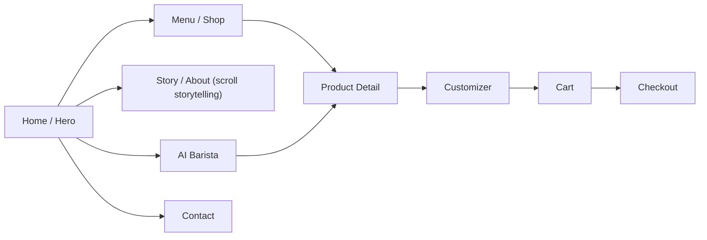

# Sitemap / User Flow

**This milestone builds Home/Hero only** — the full-viewport hero with the 3D cup, plus site-wide navigation chrome (which links toward the other nodes as placeholder routes/anchors, not built-out pages). Menu, Product Detail, Customizer, Cart/Checkout, Story, and AI Barista arrive in Milestones 2–8 per [08_MILESTONES.md](../08_MILESTONES.md).
